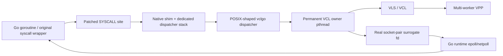

# vclgo — transparent VCL for unmodified Go applications

vclgo redirects networking from a dynamically linked, unmodified Go
application into VPP's VCL session layer. The application continues to use
Go's standard `net`, `net/http`, and runtime netpoll packages.

The current focus is **Approach #4**, also called **Approach D** or the
**Frida-Gum fastpath**:

```text
LD_PRELOAD=preload/fastpath/build/libvclgo_gum_vcl.so
```

This is not the retired Frida `Interceptor.attach`/JavaScript design and it
does not use seccomp or eBPF. Frida-Gum is linked as a native C library and is
used only to inspect and safely patch the process's in-memory executable text.

## Where Approach #4 stands

Approach #4 now routes TCP and UDP control and data operations through the
shared VCL dispatcher. It has passed:

- 128 concurrent TCP echo connections and 100 simultaneous read deadlines
  over VPP local cut-through;
- connected and unconnected routed UDP with 128 goroutines;
- routed HTTP over TCP, with and without keepalive, including five
  10,000-request rounds in each mode;
- a two-VPP, two-dataplane-worker-per-VPP topology joined by memif, with four
  VCL owner pthreads in each Go process.

These are strong lab results, not a production-readiness claim. Multi-hour
soaks, a Go-version matrix, TLS/HTTP2/gRPC coverage, container-policy
validation, and server-side listener sharding remain open. Heavy same-VPP
HTTP connection churn also exposes a cut-through defect in the tested VPP
branch; routed HTTP is therefore the TCP acceptance gate.

See [current status](docs/status.md) for the exact evidence and
[test topology](docs/test_topology.md) for what each harness does and does
not prove.

## How it works

Go normally issues raw Linux syscalls directly, so ordinary libc symbol
interposition cannot see most Go networking. The preload constructor finds
Go's `SYSCALL` sites and redirects them to a native shim.



The original Go wrapper remains responsible for its normal runtime entry/exit
sequence and error conversion. The shim converts between the Linux syscall
register ABI and the dispatcher's SysV ABI, then converts the POSIX
`-1/errno` result back to the kernel-style negative errno expected by Go's
wrapper.

VLS calls never run on a goroutine stack. They run on permanent owner
pthreads, each registered as a VCL worker. This prevents goroutine migration
from moving VCL thread-local state. New outbound sockets and independent
listeners are distributed across owners; accepted sessions remain on their
listener's owner because READY VLS sessions cannot be migrated.

## Build

```bash
make pc VPP_PREFIX=/home/aritrbas/vpp/vpp/build-root/install-vpp-native/vpp
make build-fastpath
go test ./...
go vet ./...
```

Important artifacts:

```text
preload/fastpath/build/libvclgo_gum_vcl.so
bin/libvclgo_dispatcher.so
bin/examples/*
```

## VCL configuration

Approach #4 requires a matching VPP/VCL build and `multi-thread-workers`
when `VCLGO_WORKERS` is greater than one.

```text
vcl {
  app-socket-api /path/to/vpp/app_ns_sockets/default
  app-scope-global
  use-mq-eventfd
  multi-thread-workers
  max-workers 64
}
```

Use `app-scope-local` only when intentionally testing VPP cut-through.
Routed TCP/UDP tests use global-only VCL configs on two VPP instances.

## Run

```bash
export VCL_CONFIG=/absolute/path/to/vcl.conf
export VCLGO_WORKERS=4
export LD_LIBRARY_PATH=/matching/vpp/lib:${LD_LIBRARY_PATH:-}
export LD_PRELOAD=$PWD/preload/fastpath/build/libvclgo_gum_vcl.so

exec /absolute/path/to/go-application arg1 arg2
```

If `VCL_CONFIG` is unset, the fastpath operates in kernel-passthrough mode.

| Variable | Meaning |
|---|---|
| `VCL_CONFIG` | VCL configuration; unset selects passthrough |
| `VCLGO_WORKERS` | Permanent VCL owner pthreads, 1–64 |
| `VCLGO_LOG` | 0 errors, 1 lifecycle, 2 calls, 3 trace-ring diagnostics |
| `VCLGO_FASTPATH_TRACE` | Very verbose per-syscall fastpath trace |
| `VCLGO_DISABLE` | Disable constructor behavior |

## Repository tests

The topology is part of the test contract:

- `run_smoke_fastpath.sh` and `run_concurrency_fastpath.sh` use one VPP
  with local scope and therefore test VCL cut-through.
- `run_smoke_udp_fastpath.sh` and `run_http_soak_fastpath.sh` are
  configurable; the recorded acceptance runs used two VPP instances, global
  scope, distinct VCL configs, and routed memif addresses.
- `run_smoke.sh`, `run_concurrency.sh`, and `run_http_soak.sh` exercise
  the separate Approach #3 seccomp backend.

Do not describe a same-VPP local-scope pass as a VPP TCP/UDP dataplane pass.
See [test_topology.md](docs/test_topology.md) for commands and diagrams.

## Current boundaries

- Linux x86-64 and dynamically linked Go executables only.
- TCP/IPv4, TCP/IPv6, and UDP are routed; Unix and unrelated socket families
  remain kernel-owned.
- `dup`, `dup2`, `dup3`, `F_DUPFD`, and `TCPConn.File` are not
  supported for VCL-owned descriptors.
- Ancillary data, out-of-band data, socket-specific `ioctl`, `splice`,
  and less common socket extensions are incomplete.
- Accepted sessions stay on one listener owner. Many goroutines work, but one
  listener does not automatically spread accepted children across all VCL
  owners.
- Static/setuid targets, forked-child VCL inheritance, and active
  teardown/reinitialization are unsupported.
- Process-exit teardown is terminal: live dispatcher records are abandoned
  and one authoritative VCL application detach releases VPP sessions.

## Documentation

| Document | Contents |
|---|---|
| [Documentation index](docs/README.md) | Reading order and authority |
| [Status](docs/status.md) | Exact Approach #4 evidence and limitations |
| [Test topology](docs/test_topology.md) | Routed VCL versus cut-through topology |
| [Fastpath architecture](docs/architecture_fastpath.md) | Byte-level interception design |
| [Fastpath diagrams](docs/architecture_diagrams_fastpath.md) | ABI, stack, memory, and ownership diagrams |
| [Concurrency model](docs/model_goroutine_pthread.md) | Goroutine, pthread, VLS, and VPP-worker mapping |
| [Plan](docs/plan.md) | Completed work and open gates |
| [Adoption guide](docs/adoption_guide.md) | Build, deploy, validate, and roll back |
| [Approach comparison](docs/comparison_approaches.md) | All four approaches |
| [Risk ledger](docs/analysis_bugs.md) | Fixed defects and remaining risks |

The seccomp documents remain as Approach #3 reference material. The
retrospectives describe why the old Frida Interceptor design failed; they do
not apply to the native Frida-Gum fastpath.
