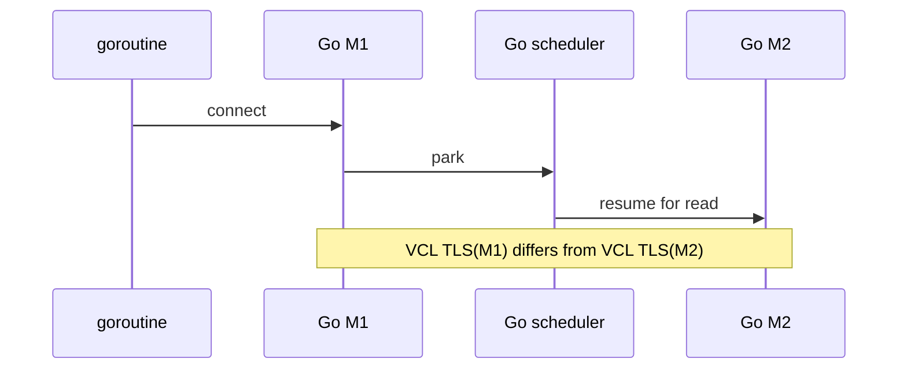

# Concurrency analysis: Go scheduling versus VCL TLS

Last updated: 2026-07-22.

This document explains the reasoning behind the normative model in
[model_goroutine_pthread.md](model_goroutine_pthread.md).

## Why one goroutine cannot equal one VCL worker

A goroutine is scheduled on Go runtime M pthreads and may resume on a
different M after blocking, preemption, stack growth, or runtime work. VCL/VLS
uses pthread-local worker state. Binding a raw VLS session to whichever M
happens to execute a goroutine would therefore change its VCL worker over
time.



A global mutex prevents simultaneous calls but does not change their pthread
identity. `runtime.LockOSThread` would require source cooperation and does
not cover goroutines created by libraries.

## Permanent-owner transformation

Approach #4 transforms:

```text
arbitrary Go M -> VLS
```

into:

```text
arbitrary Go M
  -> native fastpath dispatcher on a large pthread-local stack
  -> immutable session owner
  -> VLS
```

The source M waits only for one nonblocking owner operation. If the operation
returns `EAGAIN`, Go resumes its normal netpoll path and can park thousands
of goroutines without creating thousands of owners.

Approach #3 inserts a seccomp notifier before the same owner pool. That
notifier layer is absent from Approach #4 and must not appear in fastpath
capacity calculations.

## Four independent scheduling layers

| Layer | Unit | Selection |
|---|---|---|
| Go | goroutine on M | Go scheduler |
| vclgo | session owner | round-robin for new sockets/listeners; listener inheritance for accepts |
| VCL | application worker/TLS | owner pthread registration |
| VPP | session/dataplane worker | VPP policy |

No layer has a guaranteed one-to-one mapping to the next. Tests must verify
both VCL owner registration and VPP `show threads`, then measure actual
distribution if performance depends on it.

## Why 100 blocked reads do not need 100 owners

For each connection:

1. the goroutine's `read` reaches its owner;
2. the owner performs one nonblocking `vls_read`;
3. `EAGAIN` arms VLS epoll and returns through the original Go wrapper;
4. Go parks the goroutine on its real surrogate fd;
5. a VLS event or Go timer wakes it later.

Owners remain free to service other sessions. The recorded 100 simultaneous
250 ms deadline test validates this decomposition in the local cut-through
topology.

## Read/write and close races

One session can have a reader and writer active in Go. The owner serializes
the actual VLS operations but maintains independent read/write arm and
notification masks.

Close is a single-winner transition. Registry lookup takes a reference,
removal prevents new requests, and allocation is freed only after outstanding
requests release their references. Terminal process detach follows a
different path and never emits a burst of individual disconnects immediately
before application destroy.

## Listener concentration

An outbound workload distributes new sessions over owners. A server with one
listener does not: every accepted child inherits that listener owner. This is
correctness-preserving because VLS READY sessions cannot be migrated, but it
can cap server throughput.

Possible scaling work is multiple independently assigned listeners with
explicit reuse-port behavior. It must be tested rather than assumed.

## Topology matters to concurrency evidence

The 128-connection echo and 100-deadline tests currently exercise VCL
cut-through on one VPP. The routed HTTP tests exercise TCP across two VPPs,
and the routed UDP tests exercise connected and packet-style concurrency.
These cover different transport paths and are intentionally reported
separately in [test_topology.md](test_topology.md).

## Stack and register concurrency

The patched syscall starts on a goroutine stack, but the shim switches
`%rsp` to a 512 KiB pthread-local stack before C dispatch. A second
goroutine on another M has a different dispatcher stack. The shim explicitly
marshals Linux syscall registers to SysV arguments and returns a packed
result; it never asks a JavaScript callback to mutate a live Go CPU context.

Signals can arrive at any point. The design requires every return PC visible
on the goroutine stack to remain in Go text and every native frame to live on
the dispatcher/owner stacks.

## Capacity questions to measure

- requests per second and queue wait per owner;
- session distribution across owners;
- listener-owner hot spots;
- VPP session/dataplane worker distribution;
- surrogate wake coalescing and spurious retries;
- dispatcher-stack high-water mark;
- behavior at 100, 500, and 1,000 goroutines.

## Evidence still needed

Current evidence is summarized in [status.md](status.md). The model still
needs multi-hour preemption/load testing, multiple Go versions, target
container validation, higher protocols, error/fault injection, and
listener-sharding measurements.
