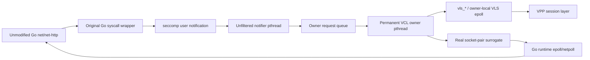
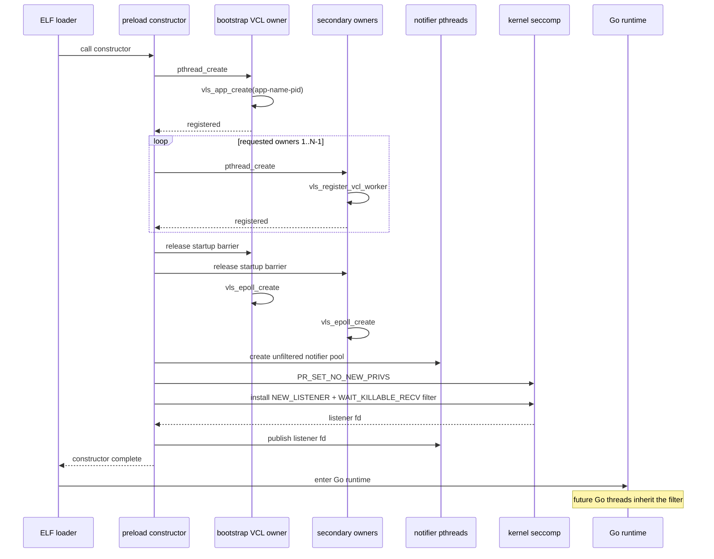
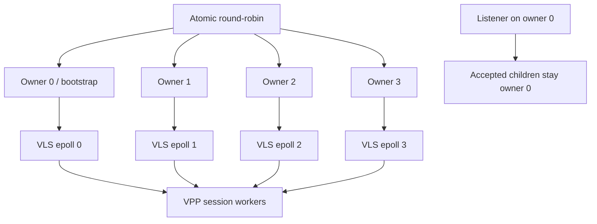
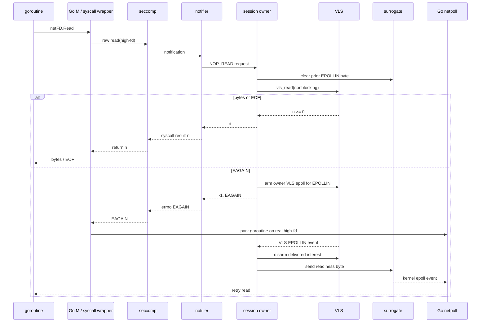
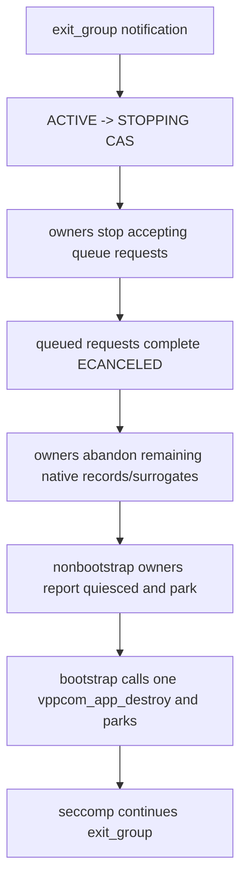

# Approach #3 architecture — seccomp user notification

> **Historical note (retained on purpose):** the Approach #3 seccomp backend
> has been removed from the codebase. This document is preserved as the
> design record of what was built and why, so future maintainers can
> understand the trade-offs. The only shipping backend is
> [Approach #4 (fastpath)](architecture_fastpath.md); diagrams for that
> backend are in
> [`architecture_diagrams_fastpath.md`](architecture_diagrams_fastpath.md).
> Diagrams for this seccomp path are collected in
> [architecture_diagrams.md](architecture_diagrams.md); concurrency proofs
> are in [model_goroutine_pthread.md](model_goroutine_pthread.md).

## 1. Problem and design decision

Two constraints must be satisfied simultaneously:

1. Go networking normally enters Linux with raw `SYSCALL` instructions, so
   libc symbol interposition alone cannot see the calls.
2. VCL/VLS maintains worker state in pthread-local storage, while a goroutine
   may move among Go runtime OS threads.

The native design intercepts at the kernel syscall boundary and moves all VLS
operations onto permanent pthreads. It deliberately does not patch Go code.



## 2. Components

| Component | Process/thread context | Responsibility |
|---|---|---|
| `bin/vclgo` | Launcher process | Validate target, set `LD_PRELOAD`, forward signals |
| `libvclgo_preload.so` constructor | Initial target thread | Initialize dispatcher, create helpers, install filter |
| Seccomp BPF filter | Kernel | Select only relevant raw syscalls from the Go executable |
| Notifier pool | Unfiltered pthreads | Receive notifications, translate POSIX arguments, wait for owner result |
| Dispatcher registry | Process heap + mutex | Exact high-fd to session mapping and reference lifetime |
| Owner pool | Permanent VCL-registered pthreads | Sole execution context for VLS handles |
| Owner VLS epoll | One per owner | Observe VCL read/write/error readiness |
| Socket-pair surrogate | Kernel fd table | Present real readiness to Go runtime epoll |
| VPP/VCL | Shared memory and app socket | Transport/session implementation |

## 3. Why this is still an LD_PRELOAD solution

`LD_PRELOAD` loads `libvclgo_preload.so` early enough for its constructor to
run before the Go runtime creates its normal thread population. The library
does not depend on interposing `socket()` or `read()` symbols. Instead, the
constructor installs the filter that observes Go raw syscalls.

This gives the requested deployment form:

```bash
LD_PRELOAD=/path/libvclgo_preload.so ./unmodified-go-app
```

while using a mechanism that can actually see Go I/O.

If `VCL_CONFIG` is absent, initialization enters passthrough mode and does not
install the filter.

## 4. Startup ordering

Startup ordering is a correctness property, not just initialization detail.



Owners and notifiers are created before the initial thread is filtered. Their
syscalls therefore cannot recursively notify the same interceptor.

## 5. Filter selection

The filter first validates `AUDIT_ARCH_X86_64`. It then compares the syscall
instruction pointer with the executable `PT_LOAD|PF_X` range of the main
binary.

Conceptually:

```text
if arch != x86_64:
    kill process

if instruction_pointer not in main executable text:
    allow

if syscall == socket:
    notify

if syscall == exit_group or close_range:
    notify

if syscall is fd-based and fd in [0xF0000, 0x100000):
    notify

allow
```

Range membership is only a BPF fast path. The notifier performs an exact
registry lookup before treating an fd as VCL-owned. An unrelated high fd in
the reserved range therefore continues to the kernel.

The instruction-pointer scope has three important effects:

- raw Go syscalls are visible;
- libc, VPP, notifier, and owner syscalls are not recursively trapped;
- unsupported syscalls can safely continue on the kernel path.

## 6. Notification contract

A notifier receives a `struct seccomp_notif`, verifies that the notification
still belongs to a local task, checks `SECCOMP_IOCTL_NOTIF_ID_VALID`, and
dispatches it.

Results are converted to kernel syscall form:

| Dispatcher outcome | Seccomp response |
|---|---|
| `rv >= 0` | `resp.val = rv` |
| `rv < 0`, `errno = E` | `resp.error = -E` |
| Kernel fallback | `SECCOMP_USER_NOTIF_FLAG_CONTINUE` |

Pointer arguments refer to the same virtual address space because the
notifier is a thread in the target process. This makes translation fast, but
it also means invalid-pointer-to-`EFAULT` emulation is incomplete.

### Signal atomicity

Nonfatal Go preemption signals must not invalidate an already-received
notification after a VCL side effect. The filter therefore requires
`SECCOMP_FILTER_FLAG_WAIT_KILLABLE_RECV`.

Without that flag, a completed VCL write plus a rejected seccomp response can
be retried by Go, duplicating bytes. With the flag, nonfatal signals are
deferred after receipt and only fatal signals interrupt the target wait.

## 7. Session ownership

A raw VLS handle is never called from a notifier or Go runtime thread.

```text
session.owner = i

Only owner[i] may mutate or call:
    session.vlsh
    session.armed
    session.notified
    session.connecting
    session.connect_error
    session.worker_next
    vls_read / vls_write / vls_close / vls_attr / vls_epoll_ctl
```

A notifier creates a short-lived request on its own pthread stack, enqueues a
pointer under the owner's queue mutex, and waits on a request-local condition
variable. The owner completes the request before the notifier destroys that
stack object.

This rule converts the Go M:N scheduling problem into ordinary message
passing.

## 8. Multi-owner VCL setup

Owner zero is the bootstrap owner and calls `vls_app_create`. When VLS mode 2
is available, secondary owners call `vls_register_vcl_worker`. Registrations
are completed before owners create their VLS epolls and accept requests.

New outbound sockets and new independent listeners are assigned round-robin.
Accepted sessions remain with the listener owner because this VPP asserts if
an accepted session is migrated after reaching READY.



This is correct for concurrency, but a single hot listener can still
concentrate application-side VLS calls on one owner. Multiple independent
listeners with reuse-port semantics are the current scaling mechanism.

## 9. Real-fd surrogate

Returning a synthetic integer to Go is insufficient because Go immediately
registers sockets with kernel epoll. Each VCL session instead owns one end of a
real `AF_UNIX`, `SOCK_STREAM|SOCK_NONBLOCK|SOCK_CLOEXEC` socket pair.

The application endpoint is duplicated into:

```text
VCLGO_FD_BASE  = 0x000F0000  (983040)
VCLGO_FD_LIMIT = 0x00100000  (1048576, exclusive)
```

The private endpoint remains visible only to the owner.

### Independent readiness channels

A stream socket pair is full duplex, so its two directions encode readiness
independently.

```text
EPOLLIN assertion:
    owner send(private_fd, one_byte)
    application_fd becomes readable

EPOLLIN reset:
    owner recv(application_fd) until EAGAIN

EPOLLOUT suppressed:
    fill application_fd -> private_fd send queue until EAGAIN

EPOLLOUT assertion:
    owner drains private_fd
    application_fd becomes writable

EPOLLOUT reset:
    owner fills application_fd send queue again
```

An `eventfd` cannot provide this behavior because it remains writable under
normal conditions. The socket-pair design lets Go observe EPOLLIN and EPOLLOUT
as separate level transitions.

## 10. Read path



The owner never blocks inside `vls_read`; Go owns the wait and deadline.

## 11. Write path

The write path mirrors read:

1. clear the surrogate EPOLLOUT assertion by refilling the application-side
   send queue;
2. call nonblocking `vls_write`;
3. return bytes immediately on success;
4. on `EAGAIN`, arm VLS EPOLLOUT and return `EAGAIN`;
5. when VLS becomes writable, drain the private endpoint to create a kernel
   EPOLLOUT transition.

Partial writes are returned as partial writes. `writev` preserves the total
number of bytes committed before the first partial or error result.

## 12. Connect path

`vls_connect` success returns zero. `VPPCOM_EINPROGRESS` and
`VPPCOM_EAGAIN` become POSIX `EINPROGRESS`; the owner arms EPOLLOUT.

On the VLS event, the owner obtains the session error and records it. Go wakes
on surrogate EPOLLOUT and calls `getsockopt(SO_ERROR)`, which consumes the
stored result.

A periodic owner-side error poll covers failure cases where a VLS writable
event is not delivered.

## 13. Accept path

The listener owner clears a prior read signal and calls nonblocking
`vls_accept`.

- On `EAGAIN`, it arms listener EPOLLIN and returns `EAGAIN` to Go.
- On success, it creates a new registry entry and socket-pair surrogate.
- The accepted VLS handle remains on the listener owner.
- Go receives a real nonblocking close-on-exec fd.

The old cross-owner adopt request was removed after VPP demonstrated that
migration of an accepted READY session violates its state contract.

## 14. Socket options

The dispatcher maps the subset required by common Go TCP applications.

| POSIX option | VLS attribute or behavior |
|---|---|
| `SO_REUSEADDR` | `SET/GET_REUSEADDR` |
| `SO_REUSEPORT` | `SET/GET_REUSEPORT` |
| `SO_KEEPALIVE` | `SET/GET_KEEPALIVE` |
| `SO_BROADCAST` | `SET/GET_BROADCAST` |
| `SO_SNDBUF` / `SO_RCVBUF` | VCL TX/RX FIFO length attributes |
| `IPV6_V6ONLY` | `SET/GET_V6ONLY` |
| `TCP_NODELAY` | `SET/GET_TCP_NODELAY` |
| `TCP_MAXSEG` | `SET/GET_TCP_USER_MSS` |
| `TCP_KEEPIDLE` | matching VCL attribute |
| `TCP_KEEPINTVL` | matching VCL attribute |
| `SO_ERROR` | owner-maintained connect completion state |
| `SO_TYPE`, `SO_DOMAIN`, `SO_PROTOCOL`, `SO_ACCEPTCONN` | session metadata |
| `SO_LINGER`, `TCP_CORK`, `TCP_CONGESTION` | documented no-op matching VPP LDP behavior |

Unknown options return `ENOPROTOOPT`; they are not silently reported as
successful.

## 15. Registry and lifetime

The registry is a mutex-protected exact hash table. Every lookup increments
an atomic reference count before releasing the registry lock.

Close on the owner performs:

1. atomically mark `closing`;
2. disarm owner VLS epoll;
3. remove the exact fd from the registry;
4. unlink from the owner list;
5. close VLS handle;
6. close both socket-pair fds;
7. release the registry's base reference.

Concurrent queued operations already holding a reference observe `closing`
and return `EBADF`; the session allocation is freed only after the final
reference is released.

## 16. Teardown

On `exit_group`, the notifier invokes dispatcher teardown before allowing the
real syscall to continue.



No per-session disconnect storm is sent immediately before detach. Ordinary
application `close` still closes one VLS session. The parked owner pthreads
avoid VCL TLS destructors after app destroy; `exit_group` terminates them.

## 17. Passthrough path

When `VCL_CONFIG` is unset:

- `vclgo_init` records PASSTHROUGH;
- no VCL owner pool is started;
- no notifier pool is started;
- no seccomp filter is installed;
- the Go binary uses its normal kernel networking.

This makes rollback an environment change rather than a binary change.

## 18. Security and deployment implications

- `PR_SET_NO_NEW_PRIVS` is set before filter installation.
- Container policies must allow the `seccomp` syscall and user notification.
- Setuid/setgid binaries are rejected because the loader suppresses preload
  behavior.
- The filter applies only to the main executable text and inherited Go
  threads, reducing recursion and blast radius.
- Same-process pointer dereference is efficient but not a security boundary;
  the target and preload library share trust.
- The listener fd and VCL internal fds must not be indiscriminately closed by
  application-specific fd sweeping.

## 19. Performance model

Each intercepted VCL I/O operation includes:

```text
Go syscall entry
  + seccomp notification wake
  + notifier -> owner mutex/condvar handoff
  + one nonblocking VLS operation
  + seccomp response
```

An `EAGAIN` operation pays that cost twice: once to arm and once after Go
netpoll wakes. This is more expensive than a source-level vclnet call but
preserves an unmodified Go application and correct runtime scheduling.

The most important scaling variables are:

- number of notifiers, which bounds simultaneous intercepted syscalls;
- number of owners, which bounds parallel VLS execution;
- listener ownership, which can concentrate accepted sessions;
- VPP worker/session configuration;
- syscall size and vectorization.

## 20. Non-goals

The Approach #3 implementation does not attempt to be a complete Linux socket ABI
virtualizer. It focuses on the syscall subset exercised by ordinary Go TCP
clients and servers. Unsupported features are listed in
[status.md](status.md) and must be added with explicit semantics and tests.
