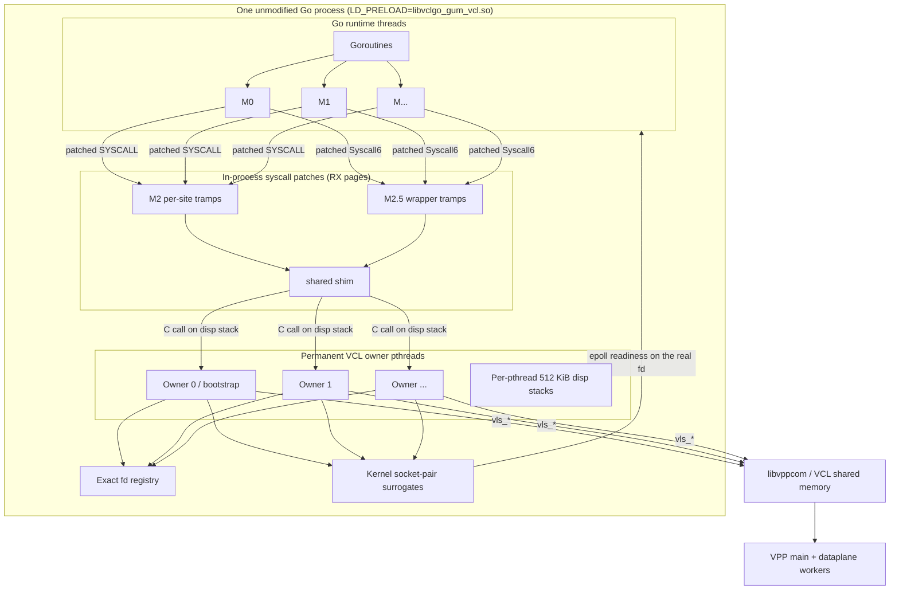
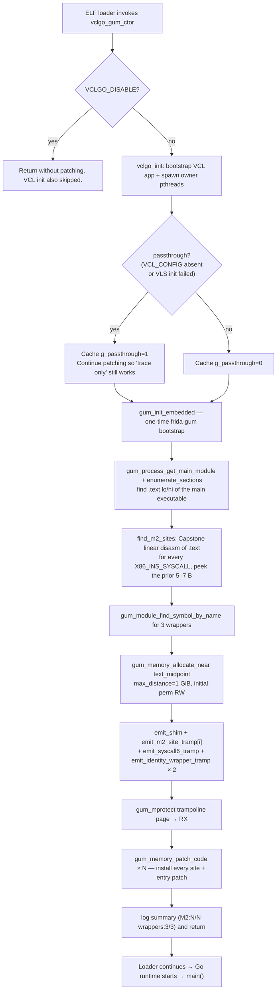
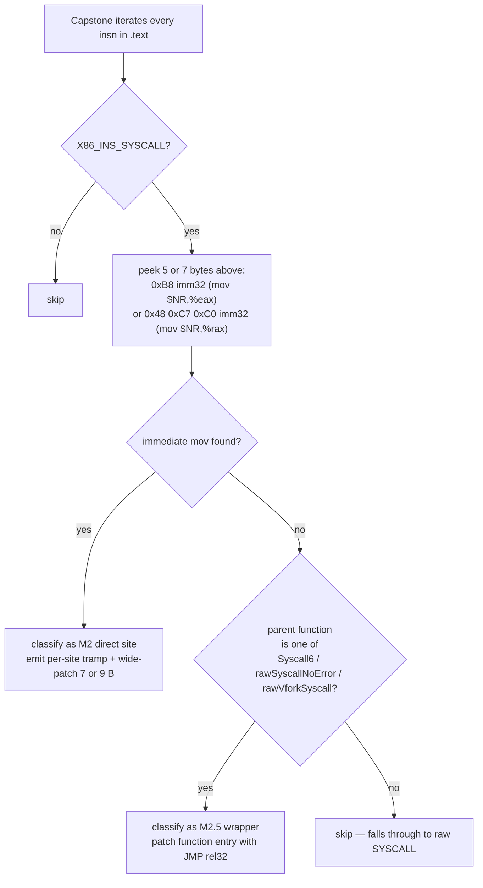
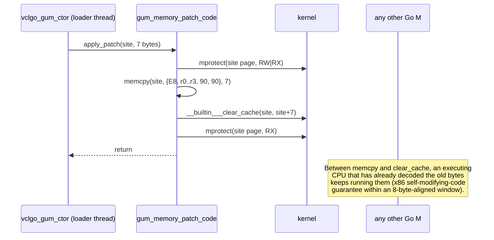
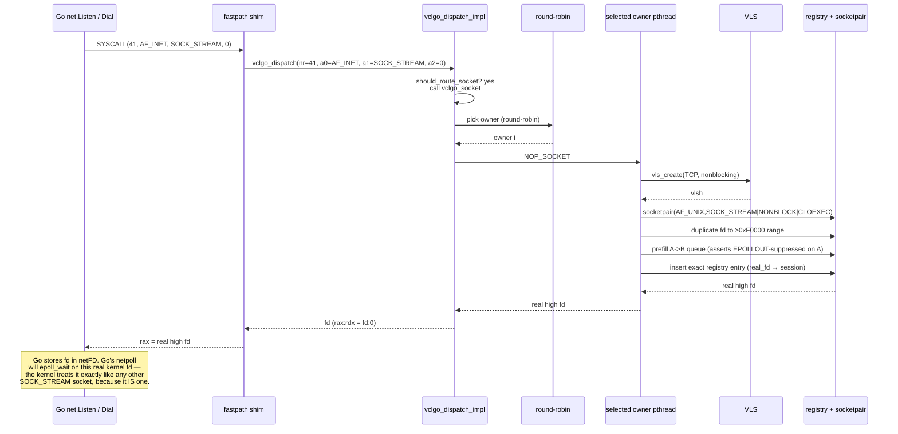
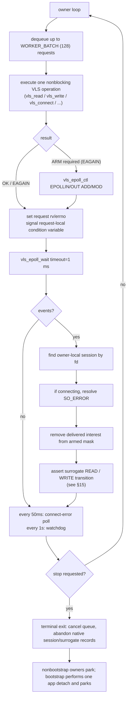

# Fastpath architecture diagram atlas (Frida-Gum, Approach #4 / D)

These diagrams describe the implementation selected by `LD_PRELOAD=libvclgo_gum_vcl.so`
— the only shipping backend. The Approach #3 seccomp backend
(`libvclgo_preload.so`) has been removed from the codebase; its diagrams
are preserved in [`architecture_diagrams.md`](architecture_diagrams.md)
as a design record. Those seccomp diagrams are neither active nor
comparative here: this document stands alone.

If you want the prose behind these diagrams, read
[`architecture_fastpath.md`](architecture_fastpath.md). If you want the
one-page comparison between the two backends, read
[`comparison_approaches.md`](comparison_approaches.md). If you want the
story of why Frida's `Interceptor.attach` (the retired Approach #B) does
*not* work for Go, read [`why_frida_dropped.md`](why_frida_dropped.md).

---

## 1. Process and thread topology



Key differences from the seccomp topology:

- **No notifier pthreads.** The seccomp path needs an unfiltered
  helper pthread to receive `SECCOMP_IOCTL_NOTIF_RECV` and dispatch to
  the owner. The fastpath does the equivalent in-process on the same
  Go thread that issued the syscall — no kernel round-trip, no
  extra pthread.
- **Patches replace the kernel entry.** The syscall never reaches the
  kernel for routed sockets. What used to be a `SYSCALL` instruction
  is now a direct `CALL` into our shim.
- **Owner pthreads and surrogates are unchanged.** Both backends share
  the same dispatcher (`bin/libvclgo_dispatcher.so`), so the VCL
  pthread-stickiness problem and its socket-pair surrogate solution
  (§13–§14) are identical.

---

## 2. Constructor pipeline

The constructor runs once, before `main()`, on the ELF loader thread.
It has 12 sequential phases. If any fails hard, we `abort()` before
Go's runtime starts.



The order matters:

- `vclgo_init` (spawns permanent owner pthreads) must happen before we
  patch any SYSCALL site, otherwise a patched-early syscall would land
  in a shim that has no owner to dispatch to.
- All emits into the trampoline page happen while the page is still
  `RW`. We only flip to `RX` once every byte of shim + tramp is in place.
- All patch installations happen after the flip. `gum_memory_patch_code`
  does its own `mprotect RW → memcpy → RX` dance atomically per site.

---

## 3. Site-decision matrix (what Capstone classifies)

The fastpath equivalent of the seccomp BPF decision tree. Instead of
kernel-time syscall classification, we classify at constructor time,
per-site, statically.



A concrete count for `bin/examples/echo_client` built with Go 1.26.1:

```text
disasm=39 patchable=36 skipped=3
  Syscall6              @ 0x409540  prologue=6  syscall_off=14  dispatch=1
  rawSyscallNoError.abi0 @ 0x4a0d40  prologue=5  syscall_off=0   dispatch=0
  rawVforkSyscall.abi0   @ 0x4a0ce0  prologue=5  syscall_off=0   dispatch=0
```

The 3 "skipped" are the SYSCALL instructions *inside* the wrappers —
we deliberately do not wide-patch those because we're already
detouring the wrapper entry (M2.5) with the correct dispatch.

---

## 4. M2 wide-patch: before / after with actual bytes

The M2 wide patch replaces `mov $NR; SYSCALL` (7 or 9 bytes) with
`CALL rel32; NOPs` (5 bytes + padding).

### 4.1 5-byte `mov` case (nr < 2^31): 7-byte overlay

At `0x4893f0` in echo_client's `.text` (`exit(60)`):

**Before**:

```text
address    bytes                         disasm
--------   --------------------------    -----------------------------
4893f0:    b8 3c 00 00 00                mov  $0x3c, %eax    ; nr=60 exit
4893f5:    0f 05                         syscall
```

**After**:

```text
address    bytes                         disasm
--------   --------------------------    -----------------------------
4893f0:    e8 XX XX XX XX                call tramp_60_at_page+128+i*16
4893f5:    90 90                         nop; nop
```

The `CALL rel32` displacement is signed 32-bit from `4893f5` (address
after the CALL) to the trampoline slot. Because we allocated the tramp
page with `gum_memory_allocate_near(.text_midpoint, ±1 GiB)`, every
patch site can reach every slot with a valid `rel32`.

### 4.2 9-byte `mov` case (nr ≥ 2^31): 9-byte overlay

Some Go internal syscalls (e.g. `gettid` uses %rax variant when
compiler picks it) emit:

```text
address    bytes                         disasm
--------   --------------------------    -----------------------------
48950a:    48 c7 c0 ba 00 00 00          mov  $0xba, %rax    ; nr=186 gettid
489511:    0f 05                         syscall
```

We overwrite the full 9 bytes with `CALL rel32; 4 NOPs`:

```text
address    bytes                         disasm
--------   --------------------------    -----------------------------
48950a:    e8 XX XX XX XX                call tramp_186_at_page+128+i*16
48950f:    90 90 90 90                   nop; nop; nop; nop
```

The extra NOPs simply extend the fall-through region. No downstream
Go code shifts.

### 4.3 Why not a 2-byte inline (zpoline-style)?

Zpoline replaces just the 2-byte SYSCALL with `callq *%rax` (FF D0),
routing through a trampoline table mapped at virtual address 0..0xFFFF.
That's elegant but requires `vm.mmap_min_addr = 0` (a kernel sysctl
that most modern distros default to non-zero for NULL-pointer-bug
mitigation) and trusts that `%rax` is always a legitimate NR at every
patch site. Wide-patching costs 5 more bytes and gets us:

- no kernel tuning, works on stock distros;
- per-site trampoline can hard-code NR from the `mov` we consumed;
- unpatched syscalls (e.g. from `libc` loaded by cgo) stay untouched.

---

## 5. Trampoline page memory layout

One 2×4 KiB anonymous mapping. Constructor writes into it while RW,
then flips it to RX before the first patched instruction is unlocked.

```text
Base = gum_memory_allocate_near(text_midpoint, 1 GiB)
      (typically within 512 MiB of the target's .text)

+------------------------------------------------------------+ page + 0
|  shared shim         emit_shim()              94 bytes     |
|                     (budget: 128 B, ends with 0xCC pad)    |
+------------------------------------------------------------+ page + 128
|  M2 tramp slot #0    16 bytes  (mov $NR0,%eax; jmp shim)   |
|  M2 tramp slot #1    16 bytes                              |
|  ...                                                       |
|  M2 tramp slot #35   16 bytes                              |
+------------------------------------------------------------+ page + 128 + 36*16
|  S6 wrapper tramp    64 bytes  (4 movs; push post; jmp)    |
|  rawSyscallNoError   64 bytes  (copied prologue; jmp back) |
|  rawVforkSyscall     64 bytes  (copied prologue; jmp back) |
+------------------------------------------------------------+
|  0xCC padding to end of page                               |
+------------------------------------------------------------+ page + 4096
|  slack second page (RX but empty)                          |
+------------------------------------------------------------+ page + 8192
```

Total live footprint with the current bounds (256 M2 sites +
3 wrappers): 4416 B. The 8192 B allocation is 2× headroom for future
generic wrappers, per-syscall counters, or Go compiler shape changes
that grow M2 site count.

---

## 6. Wide-patch atomicity (`gum_memory_patch_code`)

The patch is installed while every other thread is running Go
concurrently. If a decode-and-execute race were possible, we would
periodically stop the Go runtime with `unexpected instruction` faults.



Why this is safe on x86-64:

1. The patched window is always ≤ 9 bytes and never crosses an 8-byte
   alignment boundary that the underlying `mov+syscall` didn't already
   sit inside. Verified by the Capstone pass — sites are picked exactly
   at the `mov` opcode.
2. Intel/AMD guarantee that a single aligned 8-byte write is
   atomic wrt. instruction fetch on all cores.
3. `gum_memory_patch_code` writes the full patch in one `memcpy`
   pass followed by an `__builtin___clear_cache` icache flush.
4. Any core that had already fetched and decoded the OLD instructions
   completes them (harmlessly executes `SYSCALL` → we allow it below).
   Any core that fetches AFTER the write sees the CALL. There is no
   intermediate byte pattern the CPU can trip on.

---

## 7. M2 dispatch chain — call/return with `%rsp` state

The important design constraint: **no PC in an anonymous mapping must
ever appear as a return address on any goroutine's stack**. See §17.

```mermaid
sequenceDiagram
    participant GO as Go .text (patched site)
    participant TR as M2 per-site tramp (RX page)
    participant SH as shared shim (RX page)
    participant D as vclgo_dispatch (naked, on lib .text)
    participant DI as vclgo_dispatch_impl (C, on 512 KiB disp stack)

    Note over GO: rsp = goroutine sp
    GO->>TR: call rel32<br/>[pushes site+5 as ret addr]
    Note over TR: 10 B: mov $NR,%eax; jmp shim<br/>NOTE: jmp not call — return addr stays site+5
    TR->>SH: jmp rel32
    Note over SH: 94 B shim:<br/>saves 6 syscall args to scratch,<br/>marshals nr+a0..a4 into rdi..r9,<br/>pushes a5, call *%r11
    SH->>D: call *%r11 (movabs $vclgo_dispatch)
    Note over D: naked. swap rsp → disp stack.<br/>preserve goroutine rsp on new stack top.<br/>push a5 into SysV arg7 slot.
    D->>DI: call vclgo_dispatch_impl
    Note over DI: routes syscall to vclgo_socket, vclgo_read,<br/>vclgo_write, ... on owner pthreads.<br/>returns __int128 in rax:rdx
    DI-->>D: ret
    D-->>SH: pop rsp (atomic swap back to goroutine stack)<br/>ret
    SH-->>GO: ret
    Note over GO: pops site+5. rax:rdx hold result.<br/>Next Go insn is cmp $-4095,%rax or similar.
```

Only two return addresses ever live on the goroutine stack during this
whole chain: `site+5` (in Go's `.text`, unwind-safe) and the loader-set
`_start` return. The tramp and shim entries are entered by `jmp`, and
the disp stack push of `a5` is done above `rbp` (never below the
in-flight SP the unwinder walks).

---

## 8. M2.5 wrapper-entry detour (Syscall6 special case)

Generic Go syscall wrappers can't be M2-wide-patched because their NR
is provided at runtime — there's no immediate to encode. We handle
them by rewriting the function entry to jump to a full-conversion
trampoline.

### 8.1 Entry-point rewrite

```text
Before (0x409540, internal/runtime/syscall/linux.Syscall6):
address    bytes                         disasm
--------   ---------------------------   -----------------------------
409540:    49 89 f2                      mov %rsi, %r10
409543:    48 89 fa                      mov %rdi, %rdx
409546:    48 89 ce                      mov %rcx, %rsi
409549:    48 89 df                      mov %rbx, %rdi
40954c:    0f 05                         syscall
40954e:    48 3d 01 f0 ff ff             cmp $-4095, %rax
                                         ...result-translation block...

After:
address    bytes                         disasm
--------   ---------------------------   -----------------------------
409540:    e9 XX XX XX XX                jmp S6_tramp
409545:    90                            nop
                                         (jmp is only 5 B; nops pad
                                          the 6-byte "relocatable"
                                          prologue window)
40954c:    0f 05                         syscall      ← UNPATCHED (dead)
40954e:    ...result-translation is REACHED via post = 40954e...
```

Note the 40954c SYSCALL byte stays untouched — it becomes dead code
because control now jumps from `S6_tramp` directly to `post = 40954e`
via `push post; ret`.

### 8.2 S6_tramp layout (29 bytes in a 64-byte slot)

```text
address    bytes                                   disasm
--------   ------------------------------------    --------------------------
+0:        49 89 f2                                mov %rsi, %r10   ; verbatim
+3:        48 89 fa                                mov %rdi, %rdx   ; from Syscall6
+6:        48 89 ce                                mov %rcx, %rsi   ; entry prologue
+9:        48 89 df                                mov %rbx, %rdi   ; (Go internal
                                                                    ;  → SysV syscall
                                                                    ;  ABI conversion)
+12:       49 bb 4e 95 40 00 00 00 00 00           movabs $0x40954e, %r11
                                                    ; post = Syscall6 + 14
+22:       41 53                                   push %r11        ; fake ret addr
+24:       e9 XX XX XX XX                          jmp rel32 shim
+29:       cc cc cc ... cc                         padding
```

### 8.3 Why `push post; jmp shim` and not `call shim; jmp post`?

This is the exact same unwinder invariant as §7, but the failure was
subtler to find:

If we did `call shim; jmp post`, then throughout the entire duration
of the C dispatch, `rsp` would have a return address = `S6_tramp+29`
(pointing at our `jmp post` in the RX page). During any signal
delivered while dispatch was running (SIGURG async preemption,
SIGPROF profiling, a nested SIGSEGV from within a VLS callback),
Go's `runtime.gentraceback` walks the frame chain and demands every
return PC resolve to a known Go function via the `pclntab`. A PC in
our anonymous mapping fails the lookup and aborts the process with
`traceback did not unwind completely`. Long-blocking VLS calls
(`connect`, `read`, `write` on a routed socket) make that window
arbitrarily wide, so the crash was reliably reproducible.

With `push post; jmp shim`, the *only* return address the C dispatch
sees above its own `rip` is `post = 0x40954e` — a valid Go PC. When
the shim eventually `ret`s, the CPU pops `post` and lands directly at
Syscall6's cmp/neg/mov result-translation block, which then `ret`s
back to Syscall6's caller. Our trampoline is not on the stack when
the dispatch runs.

---

## 9. Identity-wrapper trampolines (2 of 3)

`rawSyscallNoError.abi0` and `rawVforkSyscall.abi0` don't need any
dispatcher work today — we patch them anyway so that all Go SYSCALL
sites in the binary are uniformly reachable for future filtering /
accounting. The trampoline is a NOP-detour:

```text
Before rawSyscallNoError @ 0x4a0d40:
  4a0d40:  48 8b 44 24 08                mov  8(%rsp), %rax
  4a0d45:  48 8b 7c 24 10                mov  16(%rsp), %rdi
  ...

Trampoline (identity_tramp):
  +0:      48 8b 44 24 08                mov  8(%rsp), %rax   ; copied prologue
  +5:      e9 XX XX XX XX                jmp rel32 (entry + 5)  ; back to Go .text
```

The patched entry becomes:

```text
  4a0d40:  e9 XX XX XX XX                jmp identity_tramp   ; 5 B
```

Control bounces to the tramp, executes the copied prologue on the RX
page, then jumps back to `entry + prologue_len` (5) which continues in
Go's `.text`. No syscall behaviour changes. The wrapper is
observationally identical to unpatched.

---

## 10. Shared shim: register + stack layout

Called from **both** M2 per-site tramps (via `jmp`) and the S6 tramp
(via `jmp`). Its job: convert the SysV syscall ABI to the SysV C ABI
and call `vclgo_dispatch`.

### 10.1 On entry

```text
%rax        = syscall NR
%rdi %rsi %rdx %r10 %r8 %r9   = syscall args a0..a5
%rbp        = caller's rbp (Go)
%rsp        = points at return addr (site+5 for M2, post for S6)
```

### 10.2 Stack after shim's prologue

```text
                           lower addresses
+---------------------------------------------+  <- %rsp after `sub $64,%rsp`
|  0(%rsp):  a0                               |
|  8(%rsp):  a1                               |
| 16(%rsp):  a2                               |
| 24(%rsp):  a3                               |
| 32(%rsp):  a4                               |
| 40(%rsp):  a5                               |  ← spilled from %r9
| 48-56(%rsp): unused scratch                 |
+---------------------------------------------+  <- 64 B, 16-aligned
| 0..8(%rbp) if and $-16 shifted 8 B:  gap    |
+---------------------------------------------+
|  0(%rbp):  saved rbp (caller Go)            |
|  8(%rbp):  return addr (site+5 or post)     |
+---------------------------------------------+
                           higher addresses
```

### 10.3 Marshal + call sequence

```text
mov %rax, %rdi          ; C arg0 = nr
mov  0(%rsp), %rsi      ; C arg1 = a0
mov  8(%rsp), %rdx      ; C arg2 = a1
mov 16(%rsp), %rcx      ; C arg3 = a2
mov 24(%rsp), %r8       ; C arg4 = a3
mov 32(%rsp), %r9       ; C arg5 = a4
pushq 40(%rsp)          ; C arg6 = a5 (stack slot per SysV)
movabs $vclgo_dispatch, %r11
call *%r11              ; rax:rdx = __int128 result
add $8, %rsp            ; caller-cleans-up the pushed a5
mov %rbp, %rsp; pop %rbp; ret
```

`%r10` (syscall a3) is NOT preserved across the C call. That is safe
because SysV C-ABI declares `%r10` caller-saved, and neither of the
two possible return paths (§7, §8) consumes `%r10` above the shim.

### 10.4 Why `__int128`?

The kernel syscall ABI returns two 64-bit words for a handful of
syscalls (`pipe`, `fork`) — result in `%rax`, result2 in `%rdx`.
Ordinary C functions returning `long` only populate `%rax`; `%rdx`
is caller-saved and unspecified.

Returning `__int128` on x86-64 SysV puts the low 64 bits in `%rax`
and the high 64 in `%rdx` — exactly the layout Syscall6+14's
`cmp $-4095,%rax; jbe success; ...; mov %rdx,%rbx` block expects to
read for populating the Go `r2` result.

---

## 11. Naked `vclgo_dispatch` and the stack switch

Between the shim's `call *%r11` and the C `vclgo_dispatch_impl`, we
must swap from the goroutine's tiny (2 KiB - grow-on-demand) stack to
a large POSIX stack. Otherwise the deep VPP call chain
(`vppcom_session_connect` → `session_send_ctrl_evt` → ...) blows past
the goroutine's stack guard within ~10 frames.

```text
Goroutine stack           Disp stack (per-pthread, mmap 512 KiB)
+----------------+        +-------------------------+
| ...            |        | ...                     |
| Go caller      |        |                         |
| shim frame     |        |                         |
| shim's ret     |        |                         |
| shim's rbp     |        |                         |
| shim's scratch |        |                         |
| pushed a5      |        |                         |
| return addr to |        | ← disp_stack_top - 8
|   vclgo_disp   |        | goroutine rsp saved     |
| saved rbp      |<-------| ← disp_stack_top - 16
+----------------+        | pushed a5 (SysV arg7)   |
                          | ← disp_stack_top - 24
                          | return addr to disp     |
                          | vclgo_dispatch_impl     |
                          |   local frame           |
                          | ...                     |
                          | deep VPP frames         |
                          | ...                     |
                          +-------------------------+
                          | guard page (unmapped)   |
                          +-------------------------+
```

### 11.1 The swap sequence

```text
On entry to vclgo_dispatch:
  1. push %rbp; mov %rsp, %rbp            ; frame anchor on GOROUTINE stack
  2. save 6 SysV arg regs (rdi..r9) via push
  3. sub $8, %rsp                          ; realign to 16
  4. call disp_stack_get                   ; %rax = per-pthread disp top
     (allocates and caches on first entry via pthread_setspecific;
      subsequent calls are __thread load + return)
  5. add $8, %rsp
  6. restore 6 SysV arg regs via pop
  7. mov %rsp, %r10                        ; capture goroutine rsp
  8. mov %r11, %rsp                        ; switch to disp stack top
  9. push %r10                             ; stash goroutine rsp on new stack
 10. pushq 16(%rbp)                        ; a5 → arg7 slot for the C call
                                           ; (16(rbp) is legal even after swap
                                           ; because %rbp still points into
                                           ; the goroutine stack)
 11. call vclgo_dispatch_impl              ; deep VPP call chain runs HERE
 12. add $8, %rsp                          ; pop the a5 stack arg
 13. pop %rsp                              ; ATOMIC swap back — signal safe
 14. pop %rbp; ret
```

### 11.2 Signal safety of `pop %rsp`

The single instruction `pop %rsp` is atomic wrt. signal delivery:
either the signal fires **before** the pop (in which case the handler
sees `%rsp` inside the disp stack — Go's `sigpanic` walker refuses
frames it can't map, but does not crash; the syscall retry will
converge), or **after** the pop (in which case `%rsp` is back on the
goroutine stack and everything unwinds cleanly).

Compare to `mov mem, %rsp` split across two 32-bit halves — a signal
between the halves would see torn `%rsp`. `pop %rsp` is a single
uop, no torn state.

### 11.3 Why 512 KiB per pthread?

- The deepest VPP call graph we've measured under load is < 32 KiB;
- Small enough that a system running thousands of Go worker Ms
  spends < 2 GiB on disp stacks total;
- `MAP_STACK` aligned so kernel guard-page treatment applies;
- Same 2× headroom margin the seccomp path uses for its notifier
  pthread stacks.

---

## 12. ABI conversion table

Where every argument lives at every step of the pipeline. This is the
one thing you need to memorize when reading `gum_vcl.c`.

|  Step                       | NR   | a0   | a1   | a2   | a3   | a4   | a5   |
|-----------------------------|------|------|------|------|------|------|------|
| Go's internal ABI (call Syscall6)     | %rax | %rbx | %rcx | %rdi | %rsi | %r8  | %r9  |
| SysV syscall ABI (after Syscall6 movs, and at every M2 site)  | %rax | %rdi | %rsi | %rdx | %r10 | %r8  | %r9  |
| SysV C ABI (into vclgo_dispatch)       | %rdi | %rsi | %rdx | %rcx | %r8  | %r9  | stack |
| Kernel result convention               | %rax (result) | %rdx (result2) | — | — | — | — | — |

Two conversions happen in sequence:

1. **Go internal → SysV syscall.** Done by the 4 `mov`s that live
   both at the start of Syscall6 (for wrapper calls) AND at the start
   of the S6 tramp (for patched-Syscall6 calls). M2 direct sites
   don't need this conversion because Go emits SysV-syscall-ABI-shape
   code directly at those sites.
2. **SysV syscall → SysV C.** Done inside the shared shim. Same for
   both entry paths.

The shim contains its own conversion because both entry paths converge
into it after step 1 is done.

---

## 13. Socket creation with real-fd surrogates

Identical to the seccomp path, reached without notifiers. The
socket-pair surrogate is what solves the whole VCL pthread problem —
see §14 for why.



**The fd Go sees is a REAL kernel socketpair fd**, not a VCL vlsh. Go
can `epoll_ctl`, `fcntl(F_SETFL)`, `close` it, and the kernel treats
it correctly. The "VLS-ness" of the connection lives entirely on the
owner side.

---

## 14. How the socket-pair surrogate solves VCL's pthread problem

This is the single most important design invariant in the whole
project. If you understand only one diagram in this document, make
it this one.

### 14.1 The problem: VCL is pthread-sticky, Go's runtime is not

VCL keeps per-worker state in **thread-local storage** (`__thread`
variables inside `libvppcom.so`). Every VLS handle is bound to the
pthread that created it — any other pthread calling `vls_read(vlsh)`
would touch a different worker's TLS and either return `EBADFD` or
corrupt VCL state.

Go's M:N scheduler moves goroutines across Ms freely. Two consecutive
Go statements on the same connection can run on different Ms (kernel
pthreads), so we CANNOT let Go call `vls_read` directly.

```text
Without owner isolation:
                      (BROKEN — DO NOT DO)
+----------+                              +------------+
| goro G1  |--M1--> vls_read(vlsh) -----> | VCL TLS M1 |   ← handle here
+----------+                              +------------+
                        Go scheduler
+----------+   preemption              +------------+
| goro G1  |--M2--> vls_read(vlsh) -/-> | VCL TLS M2 |   ← EBADFD or corruption
+----------+          (moved)            +------------+
```

### 14.2 The fix: permanent owner pthreads + real-fd surrogates

We create a fixed pool of **permanent** pthreads at process startup
(the "owner" pool). Each owner registers itself with VCL exactly once
and holds a lifetime affiliation with the VLS worker. Every `vls_*`
call for a given vlsh is dispatched to the owner that created it,
via a lock-protected request queue.

But Go still needs a *file descriptor* to `epoll_wait` on. VCL vlshs
are not kernel objects — they're indices into a VCL shared-memory
table. If we handed Go a vlsh directly, Go's netpoll would fail (see
[`why_frida_dropped.md`](why_frida_dropped.md) for how the Frida
approach tried this and crashed).

Instead we hand Go one end of a **real Unix socket pair**. The other
end is held by the owner. Readiness on the vlsh (delivered via
`vls_epoll_wait` on the owner side) is translated into "assert or
clear the socket-pair's kernel-visible readiness edges" (see §15).

```text
Correct architecture:
                                                 owned by us
                                        +--------------------------+
+----------+                            | Owner pthread (permanent |
| goro G1  |---M1---.                   | VCL worker registered)   |
+----------+        |                   +--------------------------+
+----------+        |                          ^          |
| goro G2  |---M2---+---> read(realfd)---.     |          |  vls_read(vlsh)
+----------+        |                    |     |          v
+----------+        |                    |     |     +---------+
| goro G3  |---M3---+                    |     |     | VPP     |
+----------+        |                    |     |     | session |
                    |                    |     |     +---------+
                    v                    v     |
              +----------------------+   |     |
              |  real kernel socket  |<--'-----+
              |  pair (Go's fd end   |  ← Go's netpoll AND read/write
              |   is high fd 0xF...) |    hit the KERNEL, not us.
              +----------------------+    We intercept read/write by
                                          patching SYSCALL bytes (§4)
                                          and routing them to the
                                          owner pthread, which then
                                          calls vls_read/write.
```

Key properties this achieves:

1. **Go netpoll works unchanged.** The fd is real; `epoll_wait` sees
   real EPOLLIN/EPOLLOUT edges the kernel actually delivered.
2. **VCL pthread stickiness is preserved.** No Go thread ever calls
   `vls_*`. Only the owner does.
3. **Signal deadlines work.** Go's `SetDeadline` uses the runtime
   poller's timer. That timer fires no matter what state the owner
   or the surrogate is in — the poller is not blocked on us.
4. **`close(fd)` works.** Kernel `close` on the surrogate is what Go
   uses to release a connection. The dispatcher gets the close via
   the patched SYSCALL, calls `vls_close(vlsh)` on the owner, and
   the surrogate half we held gets closed too.
5. **`SO_ERROR` works.** After a non-blocking connect, Go polls the
   surrogate for EPOLLOUT and then calls `getsockopt(SO_ERROR)`. The
   dispatcher's SO_ERROR handler returns the VLS connect result. No
   TLS conflict because it runs on the owner.

This solves the VCL/Go-runtime impedance mismatch **without** needing
CGo, without patching Go's runtime, and without asking VCL to become
thread-safe. The permanent owner does the VCL work; the socket-pair
does the "look like a normal fd to Go" trick.

---

## 15. Readiness encoding on the socket pair

The socket pair has **two independent kernel queues** (A→B and B→A),
and each one contributes to a different `epoll` bit. We use them
independently for READ and WRITE readiness.

```text
Layout: the socketpair has two fds, A (Go's side) and B (owner's side).
Both are ordinary AF_UNIX SOCK_STREAM. Kernel gives each end an
independent send buffer and receive queue.

                Application-visible fd (A)
                       high fd (≥0xF0000)
             +-----------------------------+
             |                             |
             |  RX queue: B -> A           |<---- owner sends 1 byte to
             |  EPOLLIN = RX queue nonempty|      assert READ ready on A
             |                             |
             |  TX queue: A -> B           |----> owner recv's from B to
             |  EPOLLOUT = TX has capacity |      make A's TX have space
             +-----------------------------+
                            Owner-only fd (B)


Initial state after socket() (assuming no VLS activity yet):
  B -> A empty          =>  EPOLLIN on A false
  A -> B prefilled full =>  EPOLLOUT on A false   ← intentionally suppressed
                                                    so Go's netpoll parks


VLS delivers EPOLLIN on vlsh → owner asserts READ:
  owner: send(B, 1 byte)   → B->A becomes 1 byte
  effect: kernel says EPOLLIN on A
  Go: netpoll wakes goroutine → goroutine issues read(A) syscall
  fastpath: read(A) is intercepted, routed to owner → vls_read(vlsh)
    (which is where the actual data comes from — the 1 byte on the
     surrogate is only a readiness token, never returned to Go)


Owner drains the READ signal after Go has consumed the readiness:
  owner: recv(A, drain) to EAGAIN → B->A back to empty
  effect: EPOLLIN on A false again


VLS delivers EPOLLOUT on vlsh → owner asserts WRITE:
  owner: recv(B, drain) to EAGAIN → A->B empties
  effect: kernel says EPOLLOUT on A (send buffer has space)
  Go: netpoll wakes → goroutine issues write(A) syscall
  fastpath: write(A) → owner → vls_write(vlsh)


Owner resets the WRITE signal:
  owner: send(B, N bytes) to refill A->B buffer
  effect: EPOLLOUT on A false again
```

Two independent queues → two independent readiness bits → we can
express any combination of (READ ready, WRITE ready) exactly like a
real TCP socket, and Go's netpoll is completely satisfied.

The bytes moving through those queues are readiness *tokens* — they
are never Go application data. Real data always moves through VLS.

---

## 16. Owner event loop



The 1 ms `vls_epoll_wait` timeout doubles as the queue wake latency
(owner requests are woken via a condition variable on the queue
mutex; the epoll poll is what unblocks between wakes). There is no
separate eventfd; the small timeout is the simplest correctness proof.

---

## 17. Two hard invariants (must never break)

Every asm design choice above is a consequence of these two rules.

### 17.1 The Go unwinder invariant

**No return address pointing into any of our anonymous mappings may
ever be live on any goroutine's stack.**

Go's `runtime.gentraceback` walks `%rbp`-chained frames on signal
delivery (`SIGURG` async preemption, `SIGPROF` profiling, nested
`SIGSEGV`). Every PC it sees must resolve via `runtime.findfunc`
back into the `pclntab` — i.e., must lie inside the Go executable's
`.text`. A PC in our tramp page or in `libvclgo_gum_vcl.so`'s `.text`
fails the lookup and triggers a fatal `unexpected return pc` /
`traceback did not unwind completely`.

The two designs that guarantee this:

- **M2 sites**: per-site tramp is entered by `jmp`, not `call`. The
  return address on the stack is `site+5`, always in Go `.text`.
- **Syscall6 tramp**: uses `push post; jmp shim`. The C code sees
  `post = Syscall6+14` as its return address, always in Go `.text`.
  Compare to the earlier `call shim; jmp post` we tried, which put
  `S6_tramp+29` (a PC in our RX page) on the stack and reliably
  crashed under signal load.

The shim itself uses `call *%r11` to enter `vclgo_dispatch`, so the
goroutine-side frame temporarily contains the shim's call-continuation PC.
`vclgo_dispatch` immediately switches to the dedicated dispatcher stack
before entering the C implementation, and the shim frame is removed before
control returns to Go.

### 17.2 The goroutine-stack invariant

**C code called from the shim must not consume more stack than the
goroutine we were called from has available.**

Goroutine stacks start at 2 KiB and grow only via Go's `morestack`
prologue check. C functions don't run that check. VLS + VPP call
chains easily use 32 KiB. The naked `vclgo_dispatch` (§11) swaps
`%rsp` to a per-pthread 512 KiB disp stack before any real C work.

This is why the seccomp path (which runs C on notifier pthreads with
their own 2 MiB stacks) was immune to this class of bug, and why our
fastpath had to reproduce that isolation in-process.

---

## 18. Old / retired designs (for reference, not active)

For a full narrative on why these were retired, see
[`why_frida_dropped.md`](why_frida_dropped.md).

### 18.1 Retired approach: `Frida.Interceptor.attach` (Approach #B)

Pattern: attach JS callbacks to Go's `syscall.Socket`, `syscall.Read`
etc. Callbacks converted arguments to C ABI, called a `NativeFunction`
into `libvppcom`, wrote the result back through the Frida `CpuContext`.

Why it failed structurally:

- Frida's Interceptor rewrites `%rip`/`%rsp` at a Go function
  boundary. Go's internal ABI is register-based and NOT SysV;
  registers are re-shuffled by the callback in ways Go's
  `pclntab`-based unwinder cannot represent.
- Long-blocking VLS calls left Frida heap pointers live in Go
  registers across GC-safe points.
- Fake VCL fds (0x40000000+) broke Go netpoll (`EBADF` on `epoll_ctl`).

Diagram of the resulting corruption:

```text
Frida.Interceptor.attach on syscall.Socket
+----------------------------------------------------------------+
| RAX/RBX/... hold Go internal ABI args and temporaries           |
| RSP points into a 2 KiB goroutine stack with Go stack maps      |
| Return PC expects Go wrapper body + runtime bookkeeping         |
+----------------------------------------------------------------+
             |
             | Frida trampoline / SysV NativeFunction bridge
             v
+----------------------------------------------------------------+
| Args reshuffled for C ABI                                       |
| Frida heap allocs referenced by CpuContext registers            |
| Result written through mutable CpuContext                       |
| VLS call runs on Go's tiny stack (overflows)                    |
| Wrapper body may not run at all if callback returned early      |
+----------------------------------------------------------------+
             |
             v
Signal or GC arrives while dispatch is in-flight
             |
             v
Go's gentraceback → PC in Frida trampoline page → NOT in pclntab
             |
             v
fatal: unexpected return pc for ...
```

### 18.2 Alternative approach: seccomp (Approach #3 / C)

The seccomp preload was removed from the codebase alongside this
retirement pass. Its complete design record is preserved in
[`architecture.md`](architecture.md) and
[`architecture_diagrams.md`](architecture_diagrams.md).

---

## 19. Failure containment table (fastpath-specific)

| Failure | Detection point | Effect |
|---|---|---|
| `VCLGO_DISABLE=1` set | Constructor | No patches, no owners; app runs kernel-native |
| VCL config absent | `vclgo_init` | `g_passthrough=1`; patches installed but every dispatch falls to raw syscall |
| Text section not found | Main-module/section scan | Log and return without VCL init or patches |
| No Go-shaped sites/wrappers (for example `bash`) | Discovery returns zero | Log and return without VPP registration |
| Wrapper symbol not found | Symbol scan | Skip it; direct sites still patch |
| `gum_memory_allocate_near` fails | Constructor allocation | Fail-fast — likely address space constraint |
| `mprotect(RX)` rejected (container profile) | `gum_mprotect` | Fail-fast — no way to install patches |
| Prologue not relocatable (unexpected Go compiler output) | `scan_prologue` returns 0 | Log and skip that wrapper; Go-version testing still required |
| Owner startup fails | `vclgo_init` | Fail-fast before patches installed |
| Owner queue admission rejected (stop set) | Request submit | `ECANCELED` |
| Session already closing | Owner handler gate | `EBADF` |
| Unsupported socket option | Owner option switch | `ENOPROTOOPT` |
| Owned `dup*` | Dispatcher `dup*` case | `EOPNOTSUPP` |
| Non-owned fd | `vclgo_owns_fd` returns 0 | Raw kernel syscall |
| Patched site's SYSCALL still executes (race between patch installer and running Go) | Kernel | ALLOWED (x86 SMC guarantees eventual convergence; the patched CALL is installed atomically; any pre-decoded SYSCALL completes harmlessly) |

---

## 20. File map for the fastpath

| File | Purpose |
|------|---------|
| `preload/fastpath/gum_vcl.c` | Full fastpath implementation (M2 + M2.5 + shim + dispatch) |
| `preload/fastpath/gum_full.c` | Trace-only variant (patches everything but passes SYSCALL through) |
| `preload/fastpath/gum_probe.c` | Standalone diagnostic — dumps site inventory |
| `preload/fastpath/vendor/frida-gum-17.16.0/` | Vendored static `libfrida-gum.a` + Capstone |
| `preload/fastpath/Makefile` | Builds all fastpath libs |
| `dispatcher/include/vclgo.h` | POSIX-shaped `vclgo_XXX` API (shared with seccomp path) |
| `dispatcher/src/pool_native.c` | Owner event loop; VLS-facing side of surrogates |
| `dispatcher/src/registry_native.c` | Socket-pair surrogate lifecycle; exact fd registry |
| `dispatcher/src/api_native.c` | POSIX API entry points; `active_gate` / `owned_gate` |
| `test/run_smoke_fastpath.sh` | Two-application, one-VPP cut-through smoke |
| `test/run_concurrency_fastpath.sh` | One-VPP cut-through payload/deadline stress |
| `test/run_smoke_udp_fastpath.sh` | Two-VPP routed connected/unconnected UDP gate |
| `test/run_http_soak_fastpath.sh` | Two-VPP routed HTTP keepalive/no-keepalive gate |
| `docs/test_topology.md` | What each topology proves |

---

## Appendix A. Concrete bytes for a VCL-owned `read()` call

Trace a Go `net.Conn.Read()` on a routed socket through every asm
step. Assume echo_client, fd=983040 (surrogate for vlsh=1), buffer at
`0x68ed6f281ac`, len=8.

**Step 1: Go's runtime issues `syscall.RawSyscall(SYS_READ, 983040, buf, 8)`.**
This lowers to `Syscall6(0, 983040, buf, 8, 0, 0, 0)`. Enters
`Syscall6@0x409540`, which is now `jmp S6_tramp`.

**Step 2: S6_tramp** (RX page, ~0x67a2c0):

```text
49 89 f2       mov %rsi, %r10   ; buf → syscall-a3 slot (unused for read)
48 89 fa       mov %rdi, %rdx   ; 8 → syscall-a2 (count)
48 89 ce       mov %rcx, %rsi   ; buf → syscall-a1 (buf ptr)
48 89 df       mov %rbx, %rdi   ; 983040 → syscall-a0 (fd)
49 bb 4e 95 40 00 00 00 00 00   movabs $0x40954e, %r11
41 53          push %r11        ; ← ret addr for our C code = Syscall6+14
e9 XX XX XX XX jmp shim
```

State on entry to shim:

```text
%rax = 0            (NR = SYS_READ)
%rdi = 983040       (fd)
%rsi = 0x68ed6f281ac (buf)
%rdx = 8            (count)
%r10 = 0            (a3)
%r8 = 0             (a4)
%r9 = 0             (a5)
0(%rsp) = 0x40954e  (fake ret addr)
```

**Step 3: shim** (RX page, ~0x67a000):

```text
push %rbp; mov %rsp,%rbp
and $-16, %rsp; sub $64, %rsp    ; align + reserve
[spill rdi..r9 to 0..40(%rsp)]
mov %rax,%rdi                    ; C arg0 = 0 (nr)
mov 0(%rsp),%rsi                 ; C arg1 = 983040 (a0=fd)
mov 8(%rsp),%rdx                 ; C arg2 = 0x68ed6f281ac (a1=buf)
mov 16(%rsp),%rcx                ; C arg3 = 8 (a2=count)
mov 24(%rsp),%r8                 ; C arg4 = 0 (a3)
mov 32(%rsp),%r9                 ; C arg5 = 0 (a4)
pushq 40(%rsp)                   ; C arg6 = 0 (a5) on stack
movabs $vclgo_dispatch, %r11
call *%r11
```

**Step 4: vclgo_dispatch** (naked, in libvclgo_gum_vcl.so `.text`):
swaps `%rsp` to disp stack, pushes a5 as SysV arg7, calls
`vclgo_dispatch_impl(0, 983040, 0x68ed6f281ac, 8, 0, 0, 0)`.

**Step 5: `vclgo_dispatch_impl`**:

```c
if (nr == __NR_read) {            /* nr == 0 */
    if (vclgo_owns_fd(fd)) {      /* 983040 owned */
        rv = vclgo_read(fd, (void *)a1, (size_t)a2);
        return posix_to_kernel(rv);
    }
    /* raw kernel syscall otherwise */
}
```

`vclgo_read` queues a `NOP_READ` request to the owner that owns
vlsh=1, waits on the request's condition variable. Owner executes
`vls_read(1, buf, 8)`. Result comes back as `rv=8` (bytes) or
`rv=-EAGAIN` (surrogate is re-armed).

**Step 6: return unwind**:

- `vclgo_dispatch_impl` returns `__int128 = (8, 0)`;
- `vclgo_dispatch`: `pop %rsp` (swap back to goroutine stack), `pop
  %rbp`, `ret` (returns to shim);
- shim: `add $8, %rsp; mov %rbp,%rsp; pop %rbp; ret` (returns to
  `0x40954e = post`);
- `post`: Syscall6's cmp/mov/ret result-translation block runs against
  `%rax=8, %rdx=0`, populating Go's `r1=8, r2=0, err=nil`;
- Go proceeds with 8 bytes copied into its buffer.

At no point does any anonymous-mapping PC sit on the goroutine stack.
At no point does C code run on the goroutine's tiny stack.
