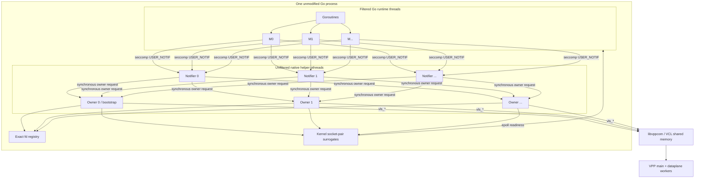
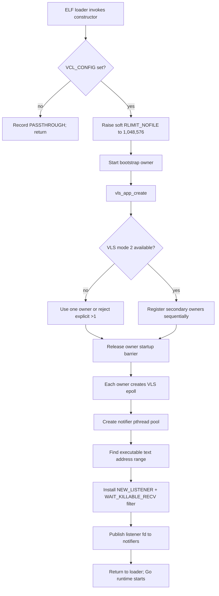
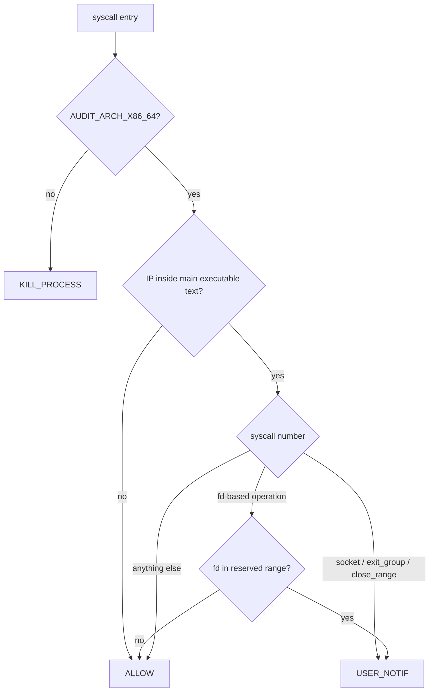
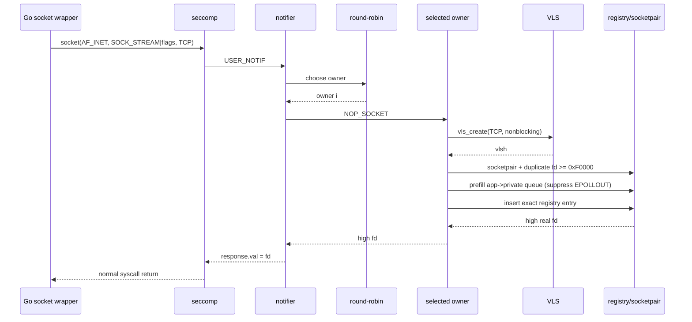
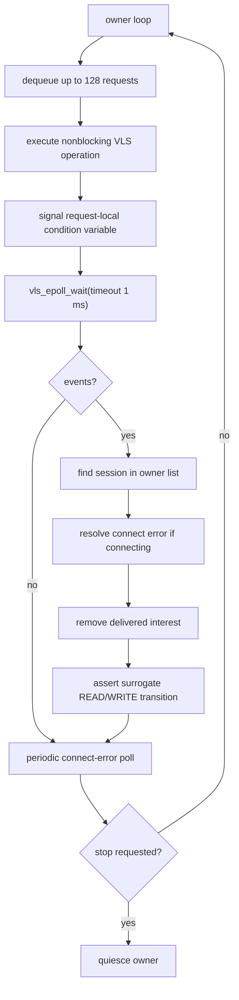
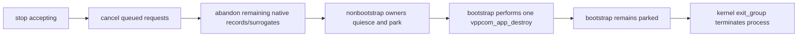

# Approach #3 diagram atlas — seccomp backend

> **Historical note (retained on purpose):** the Approach #3 seccomp backend
> has been removed from the codebase. These diagrams are preserved as the
> design record; paths and controls shown here are not available in the
> current tree. Diagrams for the shipping Approach #4 backend live in
> [`architecture_diagrams.md`](../../architecture_diagrams.md).
> The Frida-Interceptor diagrams below are comparative failures, not active
> control flow.

## 1. Process and thread topology



Key boundary: Go threads are filtered but never call VLS. Owners call VLS but
were created before filter installation and are never filtered.

## 2. Startup barrier



No future Go thread can exist before the initial thread acquires the filter,
so future runtime Ms inherit it.

## 3. BPF decision flow



The notifier repeats the fd decision with an exact registry lookup. BPF range
membership alone never establishes ownership.

## 4. Socket creation



## 5. Blocking read and deadline

```mermaid
sequenceDiagram
    participant G as goroutine
    participant M as Go M
    participant N as notifier
    participant O as owner
    participant V as VLS
    participant S as socketpair
    participant P as Go netpoll
    participant T as Go timer

    G->>M: Read
    M->>N: read notification
    N->>O: NOP_READ
    O->>V: vls_read
    V-->>O: EAGAIN
    O->>V: VLS epoll ADD EPOLLIN
    O-->>N: EAGAIN
    N-->>M: kernel returns EAGAIN
    M->>P: park G on real surrogate fd
    par data arrives
        V-->>O: EPOLLIN
        O->>S: private -> app readiness byte
        S-->>P: kernel EPOLLIN
        P-->>G: runnable; retry
    and deadline fires
        T->>P: expire pollDesc deadline
        P-->>G: runnable with timeout
    end
```

VCL does not own the deadline. There is no hidden pthread wait that must be
canceled when a Go context or timer expires.

## 6. Write readiness encoding

```text
Socket pair directions are independent:

                  application-visible fd A
                        high fd
             +-----------------------------+
             |                             |
             |  RX queue: B -> A           |<---- owner sends 1 byte
             |  EPOLLIN = RX queue nonempty|      to assert READ
             |                             |
             |  TX queue: A -> B           |----> owner drains B
             |  EPOLLOUT = TX has capacity |      to assert WRITE
             +-----------------------------+
                               private fd B
                               owner only

Initial state:
  B -> A empty        => EPOLLIN false
  A -> B filled       => EPOLLOUT false

READ ready:
  send(B, 1 byte)     => EPOLLIN true

READ consumed/reset:
  recv(A) to EAGAIN   => EPOLLIN false

WRITE ready:
  recv(B) to EAGAIN   => A has send capacity => EPOLLOUT true

WRITE consumed/reset:
  send(A) to EAGAIN   => EPOLLOUT false
```

The bytes in these queues are readiness tokens/filler only. Application data
always moves through VLS.

## 7. Owner event loop



The short VLS epoll timeout is also the queue wake latency; owner queues do not
currently have a separate eventfd.

## 8. Session heap object

```text
vclgo_native_session_t (heap)
+--------------------------------------------------------------+
| fd                     real application socketpair endpoint   |
| signal_fd              private owner socketpair endpoint      |
| vlsh                   raw VLS handle                         |
| owner                  immutable owner index                  |
| refs                   atomic lifetime count                  |
| closing                atomic close gate                      |
| meta                   family/type/listener/v6-only metadata  |
| bound_addr/bound_len    bind metadata                         |
| armed                  owner-only VLS epoll mask              |
| notified               owner-only surrogate assertion mask    |
| connecting             owner-only connect state               |
| connect_error          owner-only SO_ERROR value              |
| hash_next              registry-lock protected                |
| worker_next            owner-only list                        |
+--------------------------------------------------------------+

Mutation domains:
  registry mutex  -> hash_next and table membership
  atomics         -> refs, closing
  owner pthread   -> vlsh and every readiness/connect field
  immutable       -> owner after construction
```

There is no raw VLS handle in Go memory, a Frida heap, or a notifier-owned
global map.

## 9. Request memory and lifetime

```text
Notifier pthread stack                         Owner pthread
+------------------------------+               +----------------------+
| native_request_t req         | --queue ptr-->| dequeue pointer      |
|  mutex + condition variable  |               | inspect arguments    |
|  source session ref          |               | call VLS             |
|  pointers into blocked Go G  |               | write rv/errno       |
|  rv / errno / done           |<--signal cv---| request_finish       |
+------------------------------+               +----------------------+
             |
             +-- notifier cannot return or destroy req until done == 1
             +-- blocked Go thread cannot reuse syscall argument stack
```

The request is stack allocated but not detached. Its condition-variable
handshake is the lifetime proof.

## 10. Old register-patching failure

The retired Frida path changed live register state at a Go function boundary.

```text
Go internal ABI at syscall wrapper entry
+----------------------------------------------------------------+
| RAX/RBX/RCX/... contain Go ABI arguments and temporaries         |
| RSP points into a goroutine stack with Go stack-map expectations |
| return PC expects wrapper body + runtime bookkeeping             |
+----------------------------------------------------------------+
             |
             | Frida trampoline / SysV NativeFunction bridge
             v
+----------------------------------------------------------------+
| arguments reshuffled for C ABI                                   |
| callback scratch pointer may live in a general register           |
| result/errno written back through mutable CPU context             |
| replacement may return before original wrapper body executes      |
+----------------------------------------------------------------+
             |
             v
Potential outcomes:
  - stale Frida-heap pointer survives in a register used as code/data;
  - wrapper-local spill slot receives a value with the wrong ABI meaning;
  - runtime.entersyscall/exitsyscall balance is bypassed;
  - return PC/SP state no longer matches Go stack maps;
  - later Go code faults far away from the hook.
```

Adding more register saves would only reduce symptoms. It would not establish
a supported ABI contract between Frida, Go internal ABI, the garbage
collector, and runtime syscall bookkeeping.

## 11. Native register path

```text
Original Go wrapper
+---------------------------------------------------------------+
| establish normal Go frame / runtime syscall bookkeeping        |
| load Linux syscall number and arguments into syscall registers |
| execute SYSCALL                                                |
+---------------------------------------------------------------+
                          |
                          v
                 kernel seccomp stop
                          |
       notifier and owner operate on their own C stacks
                          |
                          v
              kernel installs return value/errno
                          |
                          v
+---------------------------------------------------------------+
| original instruction after SYSCALL resumes                     |
| original wrapper epilogue executes                             |
| original runtime exitsyscall path executes                     |
| Go ABI registers/stack maps were never rewritten by vclgo      |
+---------------------------------------------------------------+
```

The corruption class is removed by deleting register manipulation, not by
trying to make the manipulation safer.

## 12. Old stack and heap corruption path

```text
Retired path

goroutine stack (small, movable/growable only through Go-aware frames)
+------------------------------+
| Go caller frame              |
| syscall wrapper frame        |
| Frida trampoline frame       |  not represented in Go stack maps
| NativeFunction bridge        |
| vls_read -> VPP deep frames  |  several KiB, foreign ABI
+------------------------------+
          may overwrite guard/adjacent state or confuse unwinding

Frida/V8 heap
+------------------------------+
| Memory.alloc scratch         |---- pointer copied into live CPU context
+------------------------------+          |
                                          v
Go resumes with GC/unwinder unaware of that pointer's meaning/lifetime
```

## 13. New stack separation

```text
Approach #3 path

Go goroutine stack             Notifier pthread stack      Owner pthread stack
+----------------------+       +----------------------+    +----------------------+
| Go caller            |       | seccomp ioctl loop   |    | owner event loop     |
| original wrapper     |       | shallow translation  |    | vls_read/write/etc.  |
| kernel syscall stop  |       | request + wait       |    | VPP call depth       |
+----------------------+       +----------------------+    +----------------------+
 unchanged and blocked           256 KiB configured           2 MiB configured

No VPP frame is pushed on a goroutine stack.
No Frida/V8 heap exists in the Approach #3 path.
No callback writes Go registers or stack slots.
```

`readv` walks bounded iovecs directly; the prior large intermediate
notifier allocation was removed. No buffer pointer is stored in live Go
register context.

## 14. Seccomp response signal race

### Unsafe ordinary notification

```mermaid
sequenceDiagram
    participant G as blocked Go M
    participant N as notifier
    participant O as owner/VCL
    participant S as SIGURG

    N->>O: perform write
    O-->>N: bytes committed
    S->>G: nonfatal preemption signal
    Note over G: notification may be canceled
    N->>G: NOTIF_SEND
    Note over N: ENOENT; result not delivered
    G->>G: retry write
    Note over G,O: duplicate bytes possible
```

### Current killable-wait notification

```mermaid
sequenceDiagram
    participant G as blocked Go M
    participant N as notifier
    participant O as owner/VCL
    participant S as SIGURG

    N->>G: NOTIF_RECV completes
    Note over G: wait becomes killable; nonfatal signals deferred
    N->>O: perform write
    O-->>N: bytes committed
    S->>G: SIGURG deferred
    N->>G: NOTIF_SEND accepted
    G->>G: syscall returns committed byte count
    Note over G: deferred signal may now be handled
```

## 15. Concurrent close lifetime

```mermaid
sequenceDiagram
    participant R as read notifier
    participant C as close notifier
    participant REG as registry
    participant O as owner
    participant H as session heap

    R->>REG: lookup fd; refs++
    C->>REG: lookup fd; refs++
    C->>O: NOP_CLOSE
    O->>H: closing = 1
    O->>REG: remove exact fd
    O->>H: close VLS and both kernel fds
    O->>H: release base ref
    O-->>C: close complete
    R->>O: queued NOP_READ
    O-->>R: EBADF because closing
    C->>H: refs--
    R->>H: refs--, last reference frees
```

No queue element can observe freed session memory because each submitter holds
a reference through completion.

## 16. Multi-worker distribution

```text
Application owners (pthread/VLS worker)       VPP process
---------------------------------------       -------------------------
owner 0: listener L + accepted L/*  --------> main/session worker choice
owner 1: outbound sockets 1,5,9      --------> dataplane worker 0
owner 2: outbound sockets 2,6,10     --------> dataplane worker 1
owner 3: outbound sockets 3,7,11     --------> session queues/shared memory

Round-robin selects owner at socket creation.
An accepted child stays with the listener owner.
VPP dataplane worker selection is a separate VPP policy.
```

“Four vclgo owners” and “two VPP dataplane workers” are distinct dimensions.

## 17. Teardown ownership



Parking the bootstrap after app destroy prevents a pthread TLS destructor from
running against VCL process state that VPP has already invalidated.

## 18. Failure containment table

| Failure | Detection point | Effect |
|---|---|---|
| VCL config absent | Dispatcher init | Clean kernel passthrough |
| Invalid owner count | Init parser | Process exits before Go runtime |
| Mode 2 unavailable with owners >1 | Pool startup | Fail-fast with configuration message |
| Reserved fd range unavailable | RLIMIT/fd creation | Fail-fast; no ambiguous fake fd |
| Exact high fd not registered | Notifier lookup | Continue kernel syscall |
| Owner stopping | Queue admission | `ECANCELED` |
| Session already closing | Owner request gate | `EBADF` |
| Unsupported socket option | Owner option switch | `ENOPROTOOPT` |
| Unsupported duplication | Notifier | `EOPNOTSUPP` |
| Old kernel rejects killable-wait flag | Filter install | Fail-fast; do not run with duplicate-I/O risk |
