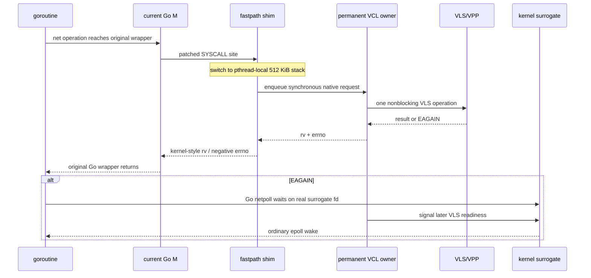
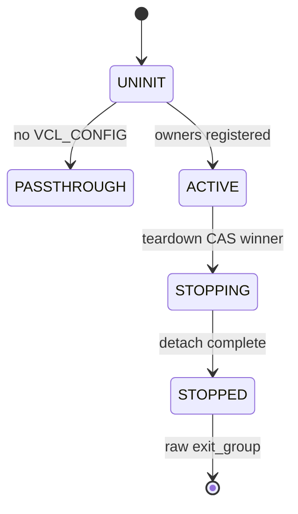

# Goroutine, pthread, and VCL ownership model

Last updated: 2026-07-23.

This is the normative concurrency model for Approach #4. The key statement is:

> A goroutine does not own a VCL worker. A VCL session owns one permanent VCL
> owner pthread.

## Entity mapping

| Entity | Created/managed by | Lifetime | Mapping rule |
|---|---|---|---|
| Goroutine (G) | Go runtime/application | Task | May move among Go Ms |
| Go M | Go runtime | Scheduler decision | Normal pthread executing Go |
| Fastpath dispatcher stack | Approach #4 pthread-local state | Source pthread | Used only during native dispatch |
| Native request | Dispatcher stack | One intercepted operation | Source dispatcher waits for owner completion |
| VCL owner pthread | vclgo | Process lifetime | Registers one VLS/VCL worker |
| VCL session | vclgo/VLS | Socket lifetime | Immutable `session.owner` |
| Surrogate fd pair | Linux kernel/vclgo | Socket lifetime | Go-visible readiness endpoint + private signaling endpoint |
| VPP session worker | VPP | VPP policy | Independent of vclgo owner index |
| VPP dataplane worker | VPP | VPP process | Independent scheduling layer |

## Required invariants

| ID | Invariant |
|---|---|
| I1 | No raw VLS handle is used outside its permanent owner pthread |
| I2 | No deep native/VCL call graph runs on a goroutine stack |
| I3 | No anonymous trampoline return PC remains live on a goroutine stack |
| I4 | The original Go syscall wrapper completes its normal runtime/error path |
| I5 | Every VCL-owned Go fd is a real kernel fd suitable for epoll |
| I6 | Exact registry membership, not high-fd range alone, establishes ownership |
| I7 | Session allocation remains alive until all synchronous requests release it |
| I8 | Close is a single-winner owner operation |
| I9 | Owner-only readiness/session fields have no cross-thread writers |
| I10 | Accepted READY sessions stay on the listener owner |
| I11 | Ordinary close and terminal application detach are different operations |
| I12 | Unsupported alias/socket semantics fail explicitly |

## Request path



The native request may live on the dispatcher stack because the source
pthread does not restore that stack until the owner has signaled completion.
The owner never retains the request pointer afterward.

## Why goroutine migration is safe

A goroutine can execute `connect` on M1, be parked by Go netpoll, and resume
for `read` on M7. Both operations look up the session's immutable owner and
are executed by that same owner pthread. VCL TLS follows the owner, not the
goroutine or current M.

`runtime.LockOSThread` is neither required nor sufficient for unmodified
applications.

## Session assignment

- New outbound sockets: owner round-robin.
- New independent listeners: owner round-robin.
- Accepted sessions: listener owner.
- All later read/write/option/close operations: recorded session owner.

VLS does not safely migrate an accepted session after it reaches READY, so a
single listener intentionally concentrates its children on one owner.

## Readiness and deadlines

Each session has a nonblocking socket pair:

```text
Go-visible fd <---- kernel socket-pair queue ----> private owner fd
```

The owner arms VLS epoll after `EAGAIN`. When VLS reports readiness, it
asserts the corresponding surrogate transition. Go's unmodified runtime
epoll loop wakes the goroutine. A Go deadline is still a Go timer; it can wake
the goroutine even when VLS produces no event.

Read and write readiness are tracked independently in native masks. Payload
bytes never travel through the surrogate.

## Concurrent operations

Go permits one reader and one writer on a `net.Conn`. They may reach the
same owner concurrently, but the owner serializes individual VLS calls while
maintaining separate read/write readiness state.

Close removes the registry entry, marks `closing` once, cancels/disarms
readiness, closes VLS and surrogate descriptors, and releases the owner-held
session reference. Already-issued synchronous requests retain references
until they complete.

## UDP ownership

UDP uses the same session-owner rule. Connected UDP peer state is owner-only.
An unconnected datagram carries its destination/source per operation;
connected `write` and `getpeername` use the cached peer. Port-0 ephemeral
selection and collision retry also execute on the owner. Wildcard datagram
source selection uses an eight-entry cache on that owner; neither its
temporary probe handle nor its cached route state crosses VCL worker TLS.

## Process lifecycle



Terminal teardown:

1. stops new queue admission and cancels queued requests;
2. owners abandon remaining dispatcher/surrogate records without per-session
   VLS disconnects;
3. nonbootstrap owners report quiesced and park;
4. bootstrap performs one `vppcom_app_destroy()` and parks;
5. the intercepted `exit_group` resumes as a raw syscall and terminates all
   threads.

Startup-failure cleanup is different: it explicitly closes/unregisters what
was created and joins threads because no live application detach is in
progress.

## Scaling model

Let `O` be owner pthreads and `S_i` sessions assigned to owner `i`.

- Independent owners can execute VLS operations in parallel.
- Owner `i` serializes operations across `S_i`.
- Blocked goroutines wait in Go netpoll after the initial `EAGAIN`; they do
  not consume one owner each.
- One listener's accepted sessions all contribute to one `S_i`.
- VPP worker assignment is a separate policy; it is not `i`.

Increasing owners helps only if sessions/listeners distribute over them and
VLS mode 2 is enabled. For a server dominated by one listener, multiple
listeners may be more important than merely increasing `VCLGO_WORKERS`.

## Evidence and remaining proof obligations

The model has passed 128 concurrent cut-through TCP echo sessions, 100
simultaneous deadlines, routed 128-way UDP, and a routed 100-way
TCP/UDP/TLS/HTTP2/gRPC matrix.

The production target is app-local cut-through. Its UDP and higher-protocol
coverage is still missing, and prior HTTP cut-through churn failed in the
tested VPP branch. Also required are long-duration 100–1,000-goroutine runs,
listener-sharding measurements, fault injection, and a Go-version matrix. See
[status.md](status.md), [plan.md](plan.md), and
[test_topology.md](test_topology.md).
