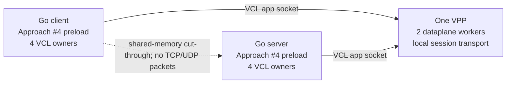
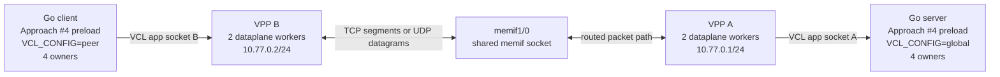
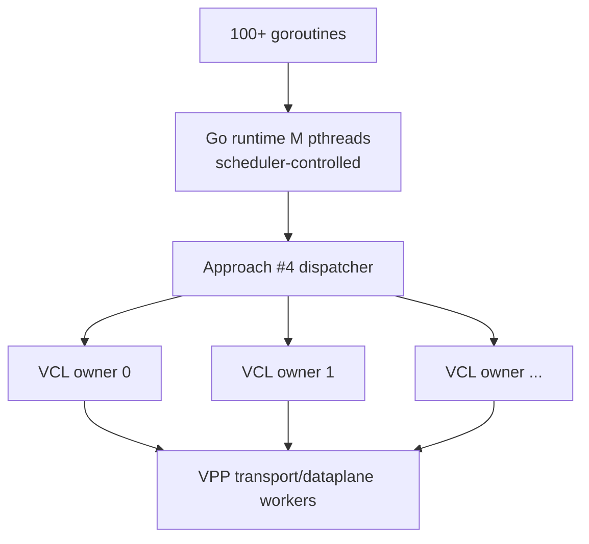

# Test topology

Last updated: 2026-07-22.

This document is the authority for the topology behind every repository
integration test. It prevents two very different paths from being described
as the same thing:

- **VCL cut-through:** two applications attach to one VPP with local scope.
- **Routed VCL:** the applications attach to different VPP instances and
  communicate through VPP TCP/UDP over memif.

Both use VCL. Only the second validates the VPP TCP/UDP packet data plane.

## Topology summary

| Topology | VPP processes | VCL scope | Network hop | What it validates |
|---|---:|---|---|---|
| Kernel passthrough | 0 | None | Linux kernel | Patcher identity path only |
| Local cut-through | 1 | Local + global | VPP shared-memory local transport | Fastpath, dispatcher, VLS, owners, surrogates, deadlines, cut-through |
| Routed acceptance | 2 | Global only | VPP A ↔ memif ↔ VPP B | All fastpath/VCL layers plus VPP TCP or UDP transport/data plane |

## Topology A: same-VPP VCL cut-through



Both applications use `test/vcl.native.conf`, which contains
`app-scope-local` and points to:

```text
/tmp/vclgo-native-vpp/app_ns_sockets/default
```

They connect to `127.0.0.1`. Because a matching local listener is registered
inside the same VPP application namespace, VPP selects its local
cut-through transport. The flow bypasses the interface/FIB/TCP-or-UDP packet
path.

### What a cut-through pass proves

- The Go `SYSCALL` sites were patched in both processes.
- Syscall arguments/results survived the ABI bridge.
- Requests reached permanent VCL owners without relying on Go M affinity.
- VLS local sessions, socket-pair surrogate readiness, Go netpoll, deadlines,
  close, and terminal detach worked at the tested load.
- Multiple owner pthreads registered against a multi-worker VPP.

### What it does not prove

- TCP segment processing, retransmission, congestion control, or routing.
- UDP packet input/output, checksum, FIB, or interface processing.
- Connectivity between separate VPP instances or hosts.
- Even distribution of accepted sessions over owner pthreads.

### Current cut-through result and limitation

`run_concurrency_fastpath.sh` passed 128 echo connections × 32 messages ×
4096 bytes and 100 blocked-read deadlines. Heavy HTTP connection churn in
this topology can crash the tested VPP branch in its cut-through
accept/cleanup code. That failure is kept visible as a VPP cut-through issue;
it is not used as the routed TCP release gate.

## Topology B: routed two-VPP acceptance



The two VPP processes are isolated:

| Role | Runtime/CLI | VCL config | App socket | Interface address |
|---|---|---|---|---|
| Server VPP A | `/tmp/vclgo-native-vpp/cli.sock` | `test/vcl.native.global.conf` | `/tmp/vclgo-native-vpp/app_ns_sockets/default` | `10.77.0.1/24` |
| Client VPP B | `/tmp/vclgo-native-vpp-peer/cli.sock` | `test/vcl.native.peer.conf` | `/tmp/vclgo-native-vpp-peer/app_ns_sockets/default` | `10.77.0.2/24` |

Both VCL configs contain `app-scope-global` and deliberately omit
`app-scope-local`. Each VPP must have two dataplane workers for the recorded
multi-worker result. Each Go process uses `VCLGO_WORKERS=4`.

### Required end state

The harnesses expect VPP to be running already. The topology creator must:

1. Start VPP A and VPP B with distinct runtime directories, API segment
   prefixes, CLI sockets, and application sockets.
2. Enable the session layer and application socket API in both.
3. Configure a shared memif socket and a master/slave `memif1/0` pair.
4. Set both memif interfaces up and assign `10.77.0.1/24` and
   `10.77.0.2/24`.
5. Make both CLI and application sockets accessible to the test user.
6. Verify two VPP dataplane workers with `show threads`.

Representative interface commands are:

```text
# VPP A
create memif socket id 1 filename /tmp/vclgo-test-memif.sock
create interface memif id 0 socket-id 1 master
set interface state memif1/0 up
set interface ip address memif1/0 10.77.0.1/24

# VPP B
create memif socket id 1 filename /tmp/vclgo-test-memif.sock
create interface memif id 0 socket-id 1 slave
set interface state memif1/0 up
set interface ip address memif1/0 10.77.0.2/24
```

Exact VPP startup syntax is deployment-specific. The required invariant is
the end state above, not a particular CPU pinning or startup file.

### Verify before testing

```bash
VPPCTL=/matching/vpp/bin/vppctl

sudo "$VPPCTL" -s /tmp/vclgo-native-vpp/cli.sock show threads
sudo "$VPPCTL" -s /tmp/vclgo-native-vpp-peer/cli.sock show threads
sudo "$VPPCTL" -s /tmp/vclgo-native-vpp/cli.sock show interface address
sudo "$VPPCTL" -s /tmp/vclgo-native-vpp-peer/cli.sock show interface address
sudo "$VPPCTL" -s /tmp/vclgo-native-vpp/cli.sock ping 10.77.0.2
```

Do not proceed if the VCL app sockets in the selected configs do not belong
to the intended VPP instances.

## Per-test topology matrix

| Test | Backend | Default/required topology | Protocol interpretation |
|---|---|---|---|
| `test/run_smoke_fastpath.sh` | Approach #4 | One VPP, `vcl.native.conf`, 127.0.0.1 | TCP API over cut-through; diagnostic |
| `test/run_concurrency_fastpath.sh` | Approach #4 | One VPP, `vcl.native.conf`, 127.0.0.1 | TCP-shaped payload/deadlines over cut-through; diagnostic |
| `test/run_smoke_udp_fastpath.sh` | Approach #4 | **Acceptance requires two VPPs and separate configs/addresses** | Routed connected + unconnected UDP |
| `test/run_http_soak_fastpath.sh` | Approach #4 | **Acceptance requires two VPPs and separate configs/addresses** | Routed HTTP over VPP TCP |
| `test/run_smoke.sh` | Approach #3 | Existing single-VPP harness | Seccomp backend reference, commonly cut-through |
| `test/run_concurrency.sh` | Approach #3 | Existing single-VPP harness | Seccomp backend reference, commonly cut-through |
| `test/run_http_soak.sh` | Approach #3 | Existing single-VPP harness | Seccomp backend reference |
| `test/start_vpp.sh` | Infrastructure | One VPP + loopback | Convenience for local/cut-through tests; does not create routed pair |

The UDP and HTTP fastpath scripts still have local-address defaults for
developer convenience. A run that leaves both endpoints on the same VPP is
not the recorded routed acceptance test.

## Routed UDP test

The harness covers both Go UDP APIs:

- connected: `DialUDP` → `connect` + `write` + `read`;
- unconnected: `ListenPacket` → `bind` + `WriteTo` + `ReadFrom`.

```bash
VPP_PREFIX=/matching/vpp/prefix \
VCLGO_WORKERS=4 \
SERVER_VCL_CONFIG=$PWD/test/vcl.native.global.conf \
CLIENT_VCL_CONFIG=$PWD/test/vcl.native.peer.conf \
SERVER_ADDR=10.77.0.1:9877 \
CLIENT_LOCAL_ADDR=10.77.0.2:0 \
UDP_CONC=128 UDP_MSGS=8 UDP_SIZE=512 \
bash test/run_smoke_udp_fastpath.sh
```

Recorded result: both modes completed with zero errors and 524,288 bytes in
each direction per mode.

Same-VPP local-scope UDP is not an acceptance substitute. It can select local
session semantics that do not match `ListenPacket`, or reach VPP's local IP
input checks rather than the intended routed path.

## Routed HTTP-over-TCP test

```bash
VPP_PREFIX=/matching/vpp/prefix \
VCLGO_WORKERS=4 \
SERVER_VCL_CONFIG=$PWD/test/vcl.native.global.conf \
CLIENT_VCL_CONFIG=$PWD/test/vcl.native.peer.conf \
SERVER_ADDR=10.77.0.1:8088 \
CLIENT_URL=http://10.77.0.1:8088/ \
NO_PROXY=10.77.0.1 no_proxy=10.77.0.1 \
VPP_CLI_SOCK=/tmp/vclgo-native-vpp/cli.sock \
CLIENT_VPP_CLI_SOCK=/tmp/vclgo-native-vpp-peer/cli.sock \
ROUNDS=5 CONC=100 REQS=100 WARMUP_REQS=0 \
bash test/run_http_soak_fastpath.sh
```

Run the fresh-connection variant with the same topology:

```bash
HTTP_CLIENT_EXTRA=-no-keepalive \
VPP_PREFIX=/matching/vpp/prefix \
VCLGO_WORKERS=4 \
SERVER_VCL_CONFIG=$PWD/test/vcl.native.global.conf \
CLIENT_VCL_CONFIG=$PWD/test/vcl.native.peer.conf \
SERVER_ADDR=10.77.0.1:8088 \
CLIENT_URL=http://10.77.0.1:8088/ \
NO_PROXY=10.77.0.1 no_proxy=10.77.0.1 \
VPP_CLI_SOCK=/tmp/vclgo-native-vpp/cli.sock \
CLIENT_VPP_CLI_SOCK=/tmp/vclgo-native-vpp-peer/cli.sock \
ROUNDS=5 CONC=100 REQS=100 WARMUP_REQS=0 \
bash test/run_http_soak_fastpath.sh
```

The harness requires zero client failures, zero unsolicited/superfluous HTTP
response warnings, and zero VPP application/session residue on both VPPs
after server shutdown.

## Worker mapping in either VCL topology



There is no one-to-one goroutine ↔ Go M ↔ VCL owner ↔ VPP worker mapping.

- Goroutines migrate among Go Ms.
- A session is permanently assigned to one VCL owner.
- New outbound sockets and independent listeners are owner round-robin.
- Accepted children inherit the listener owner.
- VPP independently chooses its transport/dataplane worker.

Therefore “four VCL owners and two VPP workers” proves both layers are in
multi-worker mode; it does not prove uniform load distribution.

## Post-test checks

For routed tests, query both VPPs:

```bash
sudo "$VPPCTL" -s /tmp/vclgo-native-vpp/cli.sock show app
sudo "$VPPCTL" -s /tmp/vclgo-native-vpp/cli.sock show session verbose 1
sudo "$VPPCTL" -s /tmp/vclgo-native-vpp-peer/cli.sock show app
sudo "$VPPCTL" -s /tmp/vclgo-native-vpp-peer/cli.sock show session verbose 1
```

After both applications have exited, there must be no vclgo applications or
live sessions on either VPP. During the run, logs must show
`[vclgo/gum] vclgo_init ok ... passthrough=0` for both endpoints.

## Invalid claims to avoid

- “TCP passed” from only a same-VPP local-scope echo test.
- “UDP passed” from a kernel fallback or same-VPP packet path.
- “Four VCL owners means all accepted sessions used four owners.”
- “Two VPP workers means each VCL owner maps to one VPP worker.”
- “Routed HTTP proves the known local cut-through churn crash is fixed.”
